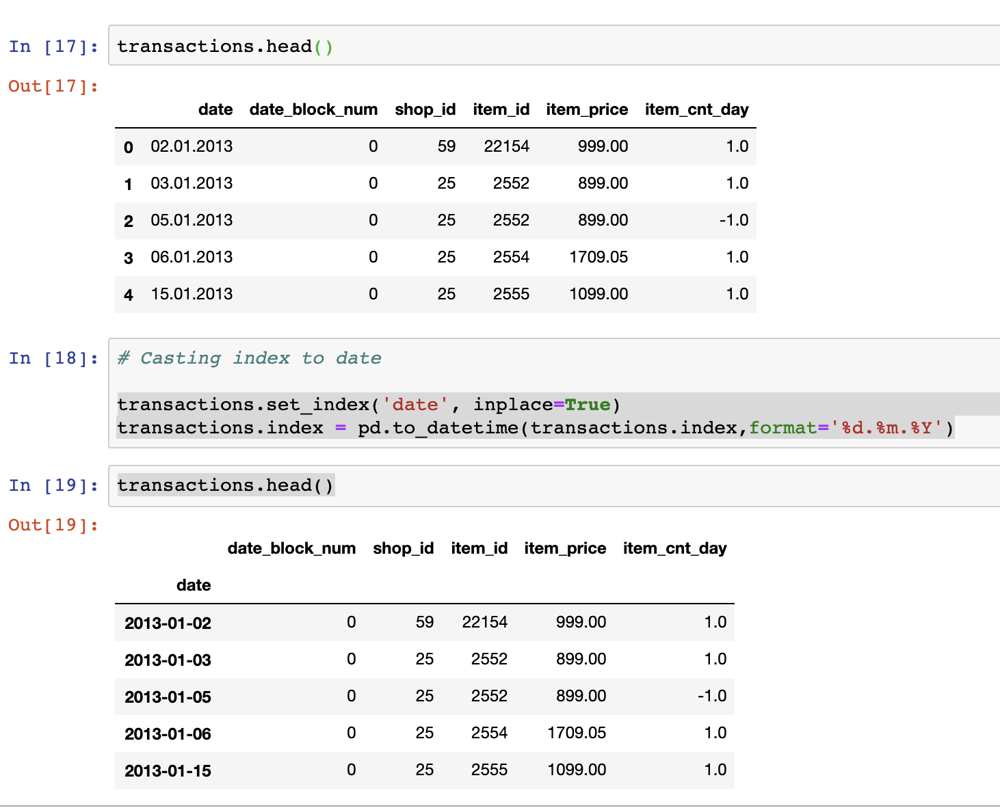

# Tip Week1

## Pandas 日期时间格式化

将其他国家的日期时间格式统一成标准的 `YYYY-mm-dd` 格式

例如： 欧洲某些国家的日期时间为 `02.01.2013` 将其转化为 `2013-01-02`

```python

df.set_index('date', inplace=True)
df.index = pd.to_datetime(df.index,format='%d.%m.%Y')

```

