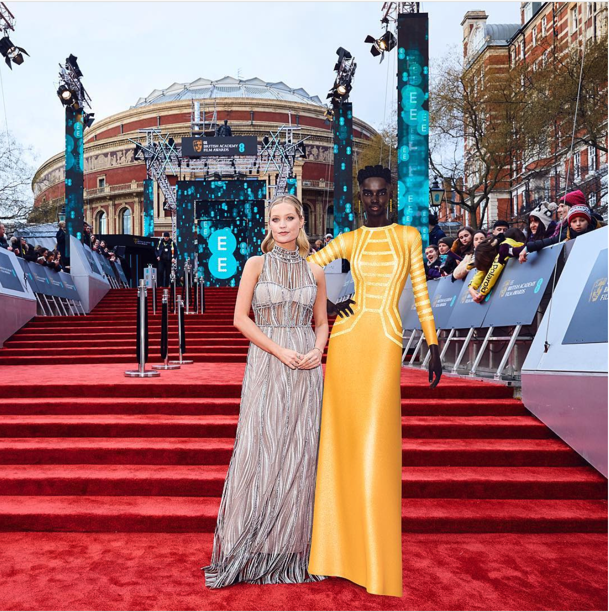

# The Future of A.I. Isn’t Quite Human

# 人工智能的未来，并不仅仅是人类。

On the red carpet or the esports arena, the next generation of celebrities could be artifical

在红毯和电子竞技领域，下一代明星很可能是人造的。

原文地址：[The Future of A.I. Isn’t Quite Human](https://onezero.medium.com/the-future-of-ai-isnt-quite-human-b91cf4919d)

Shudu 是一个虚拟形象，没有身体，仅存在于屏幕中。她大部分时候活在 Instagram 中。但是上个月 Shudu 走出我们的手机，参加了 BAFTAs 的红毯秀。Shudu 用全息影响的形式出现在现场，她穿着由施华洛世奇设计的长裙同 Regina King 和 Salma Hayek 一起合影。

Shudu 是一个理想中女性的代表，她工作在时尚领域，她的创造者是摄影师 Cameron James - Wilson （技术上来说，Shudu 是没有性别的。

乍一看，一个 A.I. 形象走进我们的真实生活出现在红毯秀，会让我们感到不和谐。但是 A.I. 早已走进我们生活的方方面面：她控制你 Facebook 的新闻推送，帮助你制作沙拉，与你在游戏中对战。虽然当星际争霸 II 中一群神族母舰出现在停靠点时也许看上去没有 Shudu 参加红毯秀更加真实，或者上周由 Facebook 创造的一个虚拟形象出现在 Wired，在屏幕后面的虚拟世界中发生着的这些前沿性工作实际上可以说是更多的关于一个新兴的类人宇宙，那里人类与机器的界限已经模糊。

毕竟，Google 不会花费高达 5 亿美金而什么也不做。Google 公司的 DeepMind 资产使用先进的算法去学习如何模仿和超越人类在游戏中的风格，但是这些与即将发生的事情相比微不足道。

“这不会消失“，Quantum Capture 的 CEO 和联合创始人 Morgan Young ，他在 Shudu 的 BAFTAs 项目工作，他告诉 OneZero。“这仅仅是个开始，当富有力量的角色与 A.I. 相融合时。”

到目前为止，这些人工智能背后都有人类的因素。一个人类的小组负责 Shudu 的 Instagram 账户的发帖，同时还包含她在 BAFTAs 上互动的限制。相同的情况也发生在另一个数字角色上，像 Hatsune Miku （初音未来），一个日本 “vocaloid” 流行明星，在现实生活中已经销售一空，甚至在美国。

>虽然 Shudu 可能从不会死去，不需要呼吸，但是 A.I. 在另外一面作为游戏的对手可能又是另外一个故事。

那是因为给机器人或者 A.I. 一个像人一样的基因是不简单的。拿来自 Hanson Robotics 的机器人 Sophia。她被编程去同人类认知，理解和交互。但是 Hanson 引人注目的营销使 Sophia 获得沙特荣誉公民，但是机器人的谈话仍是笨拙的和感觉被编程的。

与此同时， DeepMind 取得了令人信服的进步，给围观者人类的思维方式已足够的提醒。公司的一个顶尖 A.I. 项目, AlphaStar, 打败了*星际争霸 II* 的职业玩家。确实，A.I. 在之前其他一些游戏中已经玩过并打败了人类，但是*星际争霸 II* 是一个不同的游戏。它不仅是一个视频游戏，它复杂的系统需要玩家管理短期和长期的目标，同时还需要由纯机械的操作技巧来打败敌人。要玩好这个游戏需要由监督整个军队，平衡资源并且同时管理多条战线。 DeepMind 说 *星际争霸 II*在 A.I. 研究中代表了一个“伟大的挑战”，这也是为什么公司这么看重它。

游戏本身是一个价值数十亿美元的产业，拥有自己的影响者，像 Overwatch League 的专业玩家或者 Twitch 网红 Tyler Blevins 网名 Ninja。AlphaStar 的自适应学习技术显示了他自己令人信服的游戏风格 - 不是人类，人工智能也不明显。虽然 Shudu 可能从不会死去，不需要呼吸，但是 A.I. 在另外一面作为游戏的对手可能又是另外一个故事：如果它像人类一样玩游戏并且表现的像个人类，那么一个计算机生成的电子竞技影响者可能是下一个大事件。

AlphaStar 使用“深度神经网络”并用监督和强化学习的方法来训练如何玩 *星际争霸 II*。监督学习的流程包含从 *星际争霸 II* 的开发者暴雪公司发布的游戏重放中获得信息。截止这个阶段就使 AlphaStar 击败了 *星际争霸 II* 中内置的精英级别的 A.I. 这个级别等同于黄金级别的人类玩家。（黄金级别使 *星际争霸 II* 众多等级中的一个，但是这个级别在整个等级系统中是很低的：最高的级别使大师级，比黄金级高4个等级。）

接下来，DeepMind 使用这些信息构建了一个新的学习流程，这个流程通过在 *星际争霸 II* 天梯系统（对战系统）上游戏来模仿人类玩家是如何在 *星际争霸 II* 中取得好成绩的。当然，AlphaStar 自己的天梯系统填充的是早期的版本有其他游戏者创建的，在训练联盟中名字叫 “agent”。据 DeepMind 说，每一个这些代理中包含相当于多达 200 年的 “实时星际争霸游戏”，（个人评论：AlphaStar 用自己不同版本的 agent 组成的天体系统中互殴一伙的经验。）

> AlphaStar 掩饰了一个 A.I. 的适应和管理目标的能力 ... 在这方面，它已经超过了人类。

这时一种人类玩家无法获得的训练水平，这使得 AlphaStar 令人生畏。 在一月，程序击败了两名职业玩家。

AlphaStar 的设计理念不是为了模仿人类，而是建立一套自己的策略系统。AlphaStar 的成功可以帮助我们设计更多的机器人。另外我们可以看到，超过人类的 A.I. 并不需要有物理的形态。

尽管 AlphaStar 击败了人类，但是它在游戏中并没有学到人类在游戏中的礼仪，例如 “GG” （good game，一种认输的方式），所以它被其他玩家定义为 “BM”（bad mannered）。

最后，这些有个性的 A.I. 终将会进入我们的生活。