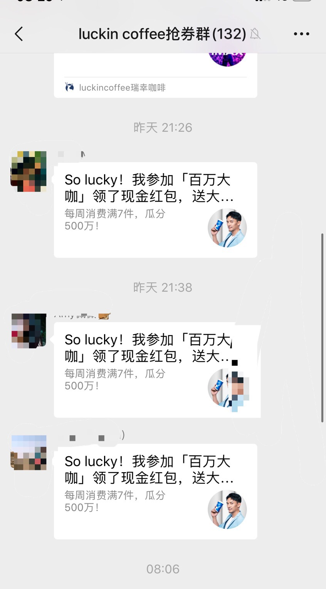

# 线上线下连锁咖啡店闲谈s

几年前开始爱上了喝咖啡，从速溶咖啡慢慢过渡到了胶囊咖啡，现磨咖啡。家里也添了胶囊咖啡机和自动咖啡机。

虽然还算不上老咖，但是各种类型的咖啡，线上线下咖啡店都尝试过。今天主要聊聊线上线下的咖啡店。

线下我去的最多的还是星巴克，没有星巴克的地方 Costa 去过不少次，Gloria Jeans ，漫咖啡还有其他品牌的咖啡店去过几次。线上最近 luckin coffee 用的最多。最近上线的星专送也用过几次。

*口味*
口味是比较个人化的，这里只谈论我个人的口味感受以及我询问身边朋友所得到的感受。这几家中最适合我的是 Starbucks，而且做为连锁店来说全国范围内的品质也是比较稳定的。再来说说 Costa ，这家咖啡店最早是与 Starbucks 对标的，主打英范儿，还有什么金奖咖啡师等等。他家口味真是不敢恭维，开始以为只是某家店做的不好，试了几家Costa后发现同一款咖啡，每家店做的都不一样，但是他们共同的特点是都不好喝。又问了身边的几个朋友，他们也有同感。我们分析了一下原因，一是咖啡师水平问题，二是品控不到位，三是咖啡豆品质差。Gloria Jeans （一家澳式咖啡连锁店），Wagas 的咖啡都可以归为好喝的一类。其他家好喝的少就不多说了。最后说说 网红咖啡 Luckin coffee，他家的口味只能算得上可以。

## Luckin coffee vs Starbucks 

Luckin coffee 是咖啡界的新贵，主打外卖咖啡。她的对标对象也是 Starbucks。
先来看一下数据，Luckin coffee 2018年成立，北京为例大众点评查到 301 家店，Starbucks 332家。Luckin coffee 的门店不同于 Startbucks 门店，基本是为外卖提供服务的。2018 年 Luckin coffee 收入 1.17 亿美元，亏损 2.32 亿美元，净亏损 1.15 亿美元，市值 22 亿 美元。前面提到过 Luckin 咖啡的口味，对我个人来说不如 Starhucks，但是在没有星专送的地方或者使用折扣时，我会选择 Luckin   咖啡。用新浪简单搜了一下对 Luckin 的评论，基本褒贬对半分，大部分人基本和我一样认为，这个价格（折后）和这个口味基本是相配的。如果原价买的话，我会选择 Starbucks。 

对我来说 2018 年 6 月至 2019 年 3 月，购买了 **24** 次共 **798** 元全部是外卖。同期星巴克线下购买 **76** 次共 **5109.2** 元。我自己在家也做咖啡喝，我觉得对一线城市来说一杯拿铁咖啡（大杯）买到25-35的价格，他的口味对我来说是可以接受的，我会经常光顾。现在 Luckin 以低于这个标准的价格来买咖啡，对我的吸引力还是蛮大的。 我所有 Luckin coffee 的购买都或多或少使用了折扣。最初，我会参加买二赠一的活动，优惠券来自官方（官方会根据我的购买习惯*定时推送*优惠券）和好友的分享，最近我被同事拉入了一个 *Luckin coffee 抢券群*

这样一来我的账户里有了差不多几十张各种折扣的优惠券。这样一来最早我可能还会用高折扣下单，现在我基本每单都会使用最低折扣下单。我想现在 luckin 大部分的销售都有折扣，所以不可否认 Luckin 吸引用户和促销的手段是高效的，但是以低于市场价 5 折来销售何时才能实现盈利。品质没有太多提升下，这些靠促销支撑的用户，她们的忠诚度又有多高呢？2019 是 Luckin 的关键，是烧光所有投资呢，还是凤凰涅槃呢，我倾向前者。
