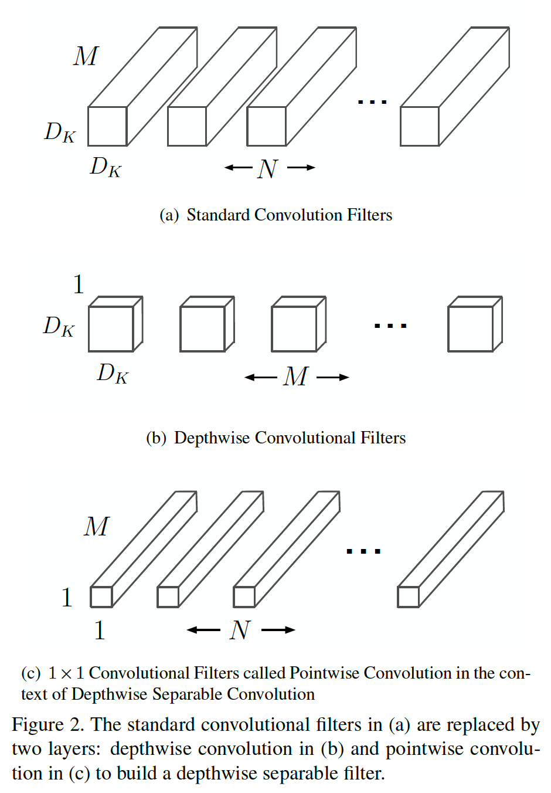
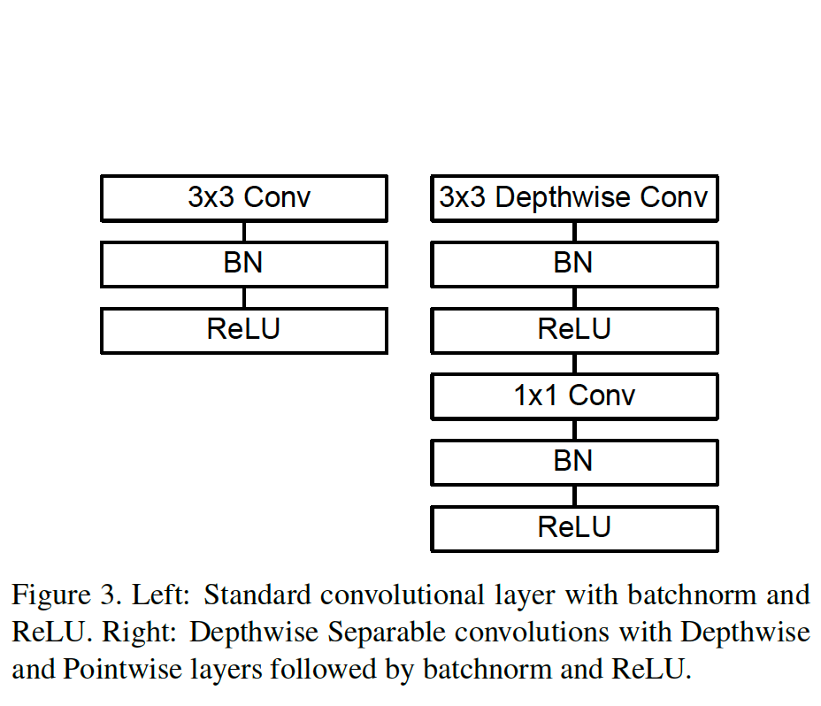
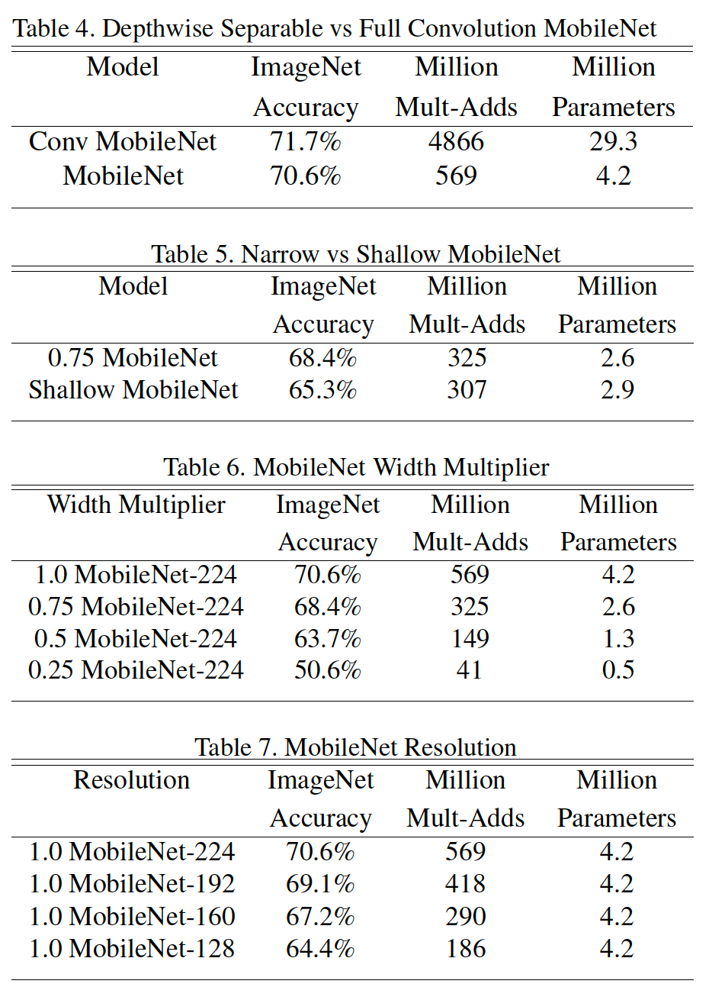
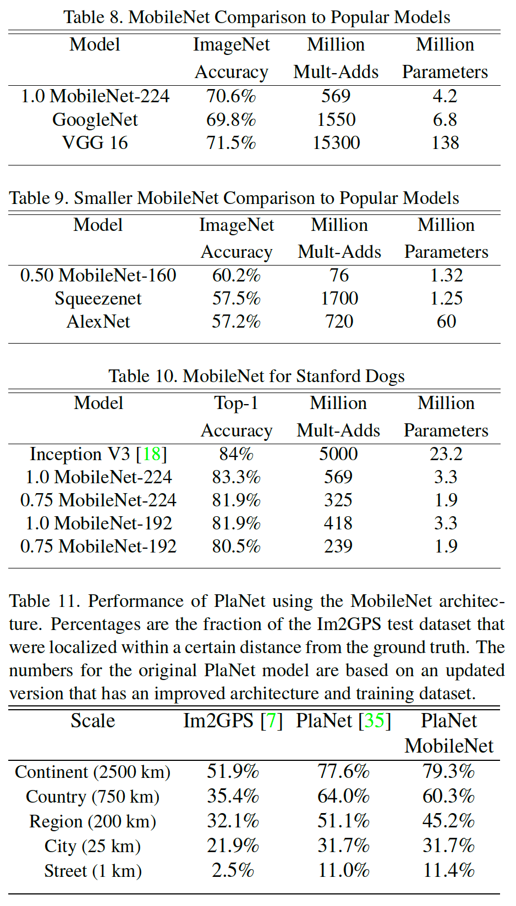

# 精读论文 Convolutional Sequence to Sequence Learning

saneryee 2019-04-14

Convolutional Sequence to Sequence Learning (2017), Jonas Gehring et al. [pdf](https://arxiv.org/pdf/1705.03122.pdf)

## 作者群信息介绍

这篇论文共有 8 位作者。均来自 Google 公司。

## 论文主要贡献

机器学习研究成果被越来越多的用于移动设备上，如手机，Pad，无人机，自动驾驶盒子等等。主要应用在 Object Detection， Finegrain Classification， Face Attributes 和 Landmark Recognition 等领域。虽然现在移动设备的内存和 CPU 均有大幅提升，甚至有些旗舰机性能已经赶上了台式机，但是仍需要一个体积小，低延迟，低能耗的模型。

MobileNets 正是在模型大小，延迟和精确度之间做了很好的权衡。

## 论文的核心方法

MobileNets 基于一个精简的架构，它使用 depthwise separable convolutions 技术建立一个轻量级的深度神经网络。然后通过调节两个简单的全局超参数，来平衡延迟和精度。这两个参数可以根据问题的约束来生成合适大小的模型。

## MobileNet 架构

### 1. depthwise separable convolutions

Depthwise separable convolutions 将传统的卷积计算分为两部分来计算，即分别计算 Depthwise Convolution 和 Pointwise Convolution ($1 \times 1$ Covolution)

如图：

标准卷积计算成本：

$$
D_{K} \cdot D_{K} \cdot M \cdot N \cdot D_{F} \cdot D_{F}
$$

Depthwise 卷积计算成本

$$
D_{K} \cdot D_{K} \cdot M \cdot D_{F} \cdot D_{F}
$$

Depthwise separable convolutions 计算成本：

$$
D_{K} \cdot D_{K} \cdot M \cdot D_{F} \cdot D_{F}+M \cdot N \cdot D_{F} \cdot D_{F}
$$

两种方式比较，计算 Depthwise separable convolutions 缩减的比率。

$$
\begin{aligned} & \frac{D_{K} \cdot D_{K} \cdot M \cdot D_{F} \cdot D_{F}+M \cdot N \cdot D_{F} \cdot D_{F}}{D_{K} \cdot D_{K} \cdot M \cdot N \cdot D_{F} \cdot D_{F}} \\=& \frac{1}{N}+\frac{1}{D_{K}^{2}} \end{aligned}
$$

### 2. Network Structure and Training

标准卷积与 Depthwise Separable 卷积网络结构的对比。

### 3. Two Hyper-parameters: Width Multiper and Resolution Multiper

**Width multiper $\alpha$**

添加 $\alpha$ 后的成本公式：$\alpha \in(0,1]$

$$
D_{K} \cdot D_{K} \cdot \alpha M \cdot D_{F} \cdot D_{F}+\alpha M \cdot \alpha N \cdot D_{F} \cdot D_{F}
$$

**Resolution multiper $\beta$**

添加 $\beta$ 后的成本公式：$\beta \in(0,1]$

$$
D_{K} \cdot D_{K} \cdot \alpha M \cdot \rho D_{F} \cdot \rho D_{F}+\alpha M \cdot \alpha N \cdot \rho D_{F} \cdot \rho D_{F}
$$

## 方法的实验效果

从表中我们可以看到不同版本 MobileNet 的计算结果比较：

MobileNet 与其他模型比较：

## 小结

MobileNet 在 Fine Grained Recogintion, Large Scale Geolocalizaton, Face Attributes, Object Detection 和 Face Embeddings 等任务都有很好的效果。

MobileNet 已在 Tensorflow 中提供。

### 参考

1. [https://medium.com/@chih.sheng.huang821/%E6%B7%B1%E5%BA%A6%E5%AD%B8%E7%BF%92-mobilenet-depthwise-separable-convolution-f1ed016b3467](https://medium.com/@chih.sheng.huang821/%E6%B7%B1%E5%BA%A6%E5%AD%B8%E7%BF%92-mobilenet-depthwise-separable-convolution-f1ed016b3467)

2. [https://www.youtube.com/watch?v=T7o3xvJLuHk](https://www.youtube.com/watch?v=T7o3xvJLuHk)

3. [https://www.cnblogs.com/jesse123/p/7575842.html](https://www.cnblogs.com/jesse123/p/7575842.html)

4. [https://eli.thegreenplace.net/2018/depthwise-separable-convolutions-for-machine-learning/](https://eli.thegreenplace.net/2018/depthwise-separable-convolutions-for-machine-learning/)