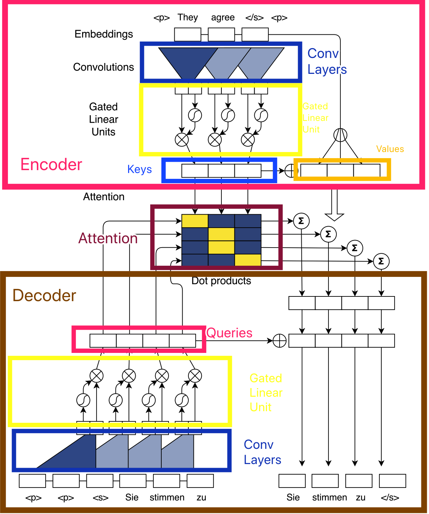
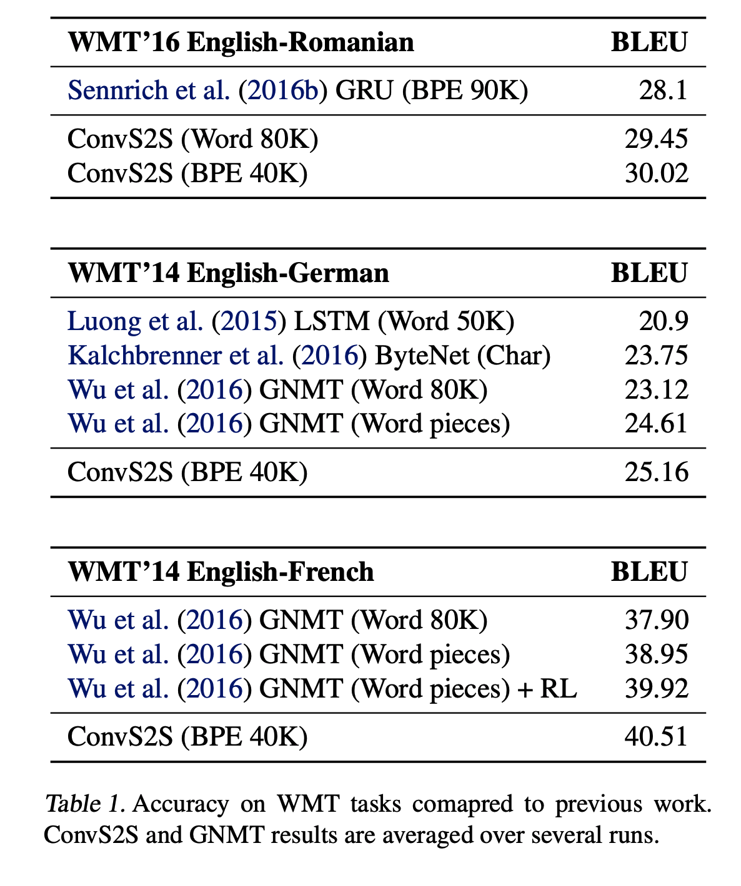
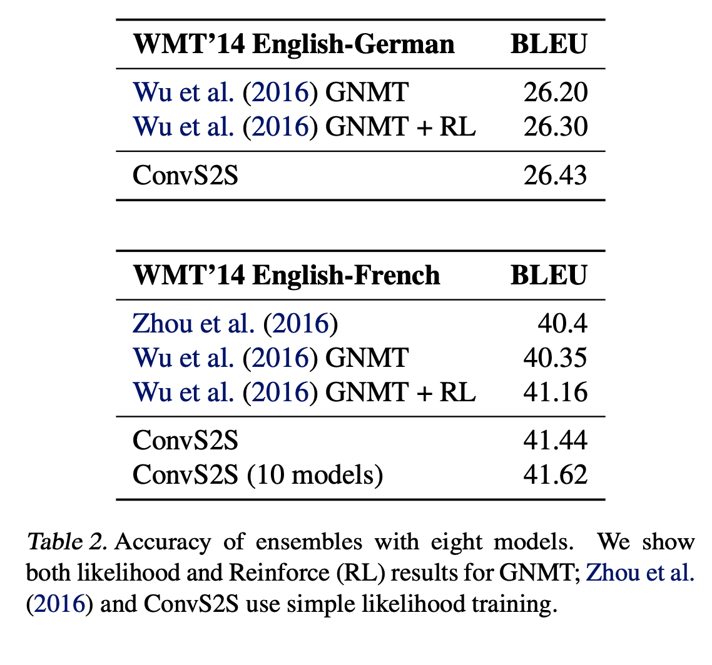
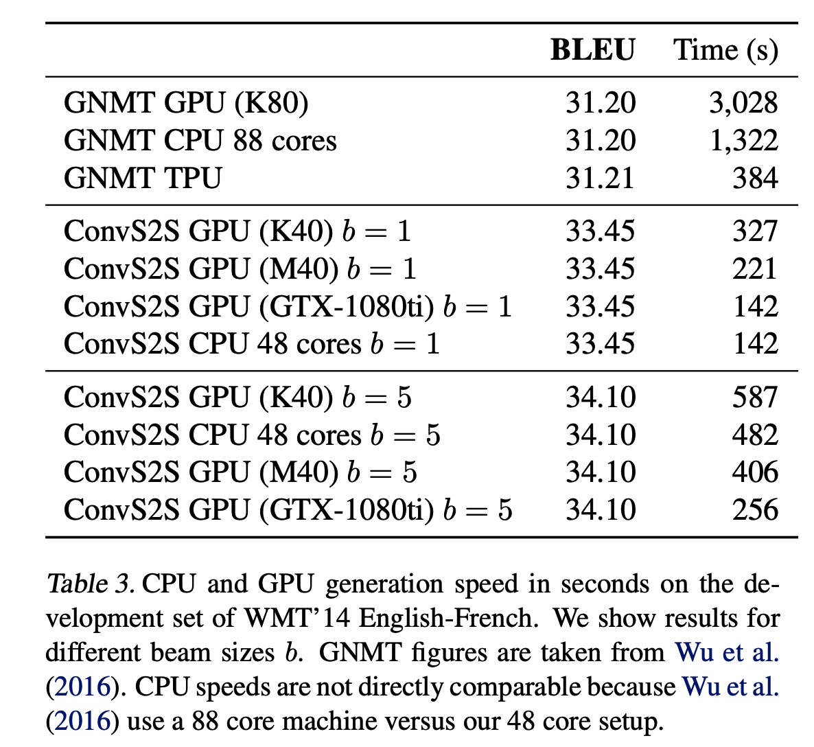

# 精读论文 Convolutional Sequence to Sequence Learning

saneryee 2019-04-14

Convolutional Sequence to Sequence Learning (2017), Jonas Gehring et al. [pdf](https://arxiv.org/pdf/1705.03122.pdf)

## 作者群信息介绍

这篇论文共有5位作者来自 Facebook AI Research 公司。

## 论文目录

    Abstract
    1. Introduction
    2. Recurrent Sequence to Sequence Learning
    3. A Convolutional Architecture
       3.1. Position Embeddings
       3.2. Convolutional Block Structure
       3.3 Multi-step Attention
       3.4 Normalization Strategy
       3.5 Initialization
    4. Experimental Setup
       4.1 Datasets
       4.2 Model Parameters and Optimization
       4.3 Evaluation
    5. Results
       5.1 Recurrent vs. Convolutional Models
       5.2 Ensemble Results
       5.3 Generation Speed
       5.4 Position Embeddings
       5.5 Multi-step Attention
       5.6 Kernel Size and Depth
       5.7 Summarization
    6. Conclusion and Future Work
    Acnowledgements
    References
    A. Weight Initialization
       A.1. Forward Pass
       A.2. Backward Pass
       A.3. Dropout
    B. Upper Bound on Squared Sigmoid
    C. Attention Visualization

## 论文主要贡献

Facebook 推出了一种基于 100% 卷积网络的序列到序列模型。相比较流行的循环神经网络，这个架构可以实现完全的并行训练可以很好的利用 GPU 的优势。

## 论文泛读

论文首先回顾了序列模型在语言领域的发展史，序列模型主要应用于：机器翻译，语音识别，文本摘要（Text summarization，一种提炼一段文本核心内容的任务）等任务。流行的方法是使用一系列双向循环神经网络分别对输入输出进行编码，同时还使用软-注意力机制。卷积神经网络虽然有很多优点，但是较少用于序列模型。
多层卷积网络在序列模型中使用较底层来处理较近的元素，使用较高层来处理相距较远的元素，这种结构与循环网络中的链式结构相比，可以用较短的路径来处理长范围的依赖。多层卷积网络的复杂度为 $\mathcal{O}\left(\frac{n}{k}\right)$, 循环网络的复杂度 $\mathcal{O}(n)$。虽然有一些方法尝试在循环神经网络中加入卷积神经网络，但是在大数据集上的提升效果并不明显。
这篇论文提到的架构使用了全卷积神经网络和注意力机制，而且在多个数据集中都有很好的效果。

## 论文的架构

模型整体架构

上图以英语到德语的翻译为例。

- 顶部：编码模块，
- 中间：计算全部四个德语单词的注意力值，解码与编码的点乘。
- 中部右侧：条件输入。通过注意力计算的条件输入，添加到解码器状态中，用来预测目标词。
- 底部左侧：上下文解码
- 底部右侧：目标词

该论文的核心架构由以下几部分组成。

1. Position Embeddings

   - 原始输入: $\mathbf{x}=\left(x_{1}, \dots, x_{m}\right)$
   - Distributional space: $\mathbf{w}=\left(w_{1}, \dots, w_{m}\right)$
   - 输入元素在编码空间中的绝对位置: $\mathbf{p}=\left(p_{1}, \dots, p_{m}\right)$
   - 组合后的输入：$\mathbf{e}=\left(w_{1}+p_{1}, \ldots, w_{m}+p_{m}\right)$
   - 输出：$\mathbf{g}=\left(g_{1}, \dots, g_{n}\right)$

2. Convolutional Block Structure

   编码和解码网络共享一个简单的块结构，这个块基于一个固定数量的输入所计算的中间状态。这里所定义的块和层可以进行互换。每一个块包含一个一维卷积其次是一个非线性计算。对于一个解码网络有一个块和一个宽度为 $k$ 的内核，每一个结果状态 $h_{i}^{1}$ 包含 $k$ 个输入元素的信息。在彼此的上方堆积几个块可以增加输入元素的信息。

   - 第 $l$-th 解码块：$\mathbf{h}^{l}=\left(h_{1}^{l}, \ldots, h_{n}^{l}\right)$
   - 第 $l$-th 编码块：$\mathbf{z}^{l}=\left(z_{1}^{l}, \ldots, z_{m}^{l}\right)$
   - 卷积计算： $W \in \mathbb{R}^{2 d \times k d}$，$b_{w} \in \mathbb{R}^{2 d}$，$Y=[A B] \in \mathbb{R}^{2 d}$
   - 非线性计算：Gated Linear units (GLM), $v([A B])=A \otimes \sigma(B)$
   - 残差连接: $h_{i}^{l}=v\left(W^{l}\left[h_{i-k / 2}^{l-1}, \ldots, h_{i+k / 2}^{l-1}\right]+b_{w}^{l}\right)+h_{i}^{l-1}$
   - 输出: $p\left(y_{i+1} | y_{1}, \dots, y_{i}, \mathbf{x}\right)=\operatorname{softmax}\left(W_{o} h_{i}^{L}+b_{o}\right) \in \mathbb{R}^{T}$

3. Multi-step Attention

   $$
   d_{i}^{l}=W_{d}^{l} h_{i}^{l}+b_{d}^{l}+g_{i}
   $$

   $$
   a_{i j}^{l}=\frac{\exp \left(d_{i}^{l} \cdot z_{j}^{u}\right)}{\sum_{t=1}^{m} \exp \left(d_{i}^{l} \cdot z_{t}^{u}\right)}
   $$

   $$
   c_{i}^{l}=\sum_{j=1}^{m} a_{i j}^{l}\left(z_{j}^{u}+e_{j}\right)
   $$

   **$a_{i j}^{l}$**：表示 解码层 $j$, 状态 $i$，元素 $j$ 的注意力。
   
   **$d_{i}^{l}$**：解码器状态摘要

   **$z_{j}^{u}$**：最后一个编码块 $u$ 的输出

   **$c_{i}^{l}$**：条件输入

   **$e_{j}$**：输入元素嵌入值
   

4. Normalization Strategy

5. Initialization

## 方法的实验效果

Recurrent vs. Convolutional Models

1. 与 RNN 运行结果的精度比较。

WMT‘16 English-Romanian 任务：

Sennrich et al: 使用注意力为基础的 seq2seq 结构并且在编码和解码部分使用了 GRU 单元。

ConvS2S(Word 80K): 使用词因素字典的全卷积 seq2seq 模型

ConvS2S(BPE 40K): 使用 BPE 编码的全卷积 seq2seq 模型

2. 与 RNN 运行速度的比较。

## 小结

优点；

1.更快

2.捕获不同词之间的依赖更加简单。 

### 参考

1. [https://zhuanlan.zhihu.com/p/26918935](https://zhuanlan.zhihu.com/p/26918935)

2. [https://www.youtube.com/watch?v=iXGFm7oC9TE&t=7s&ab_channel=SteeveHuang](https://www.youtube.com/watch?v=iXGFm7oC9TE&t=7s&ab_channel=SteeveHuang)