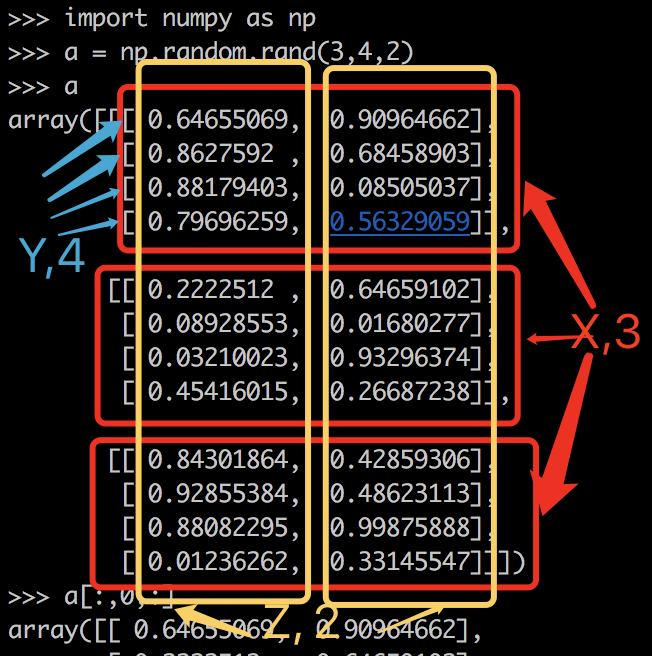
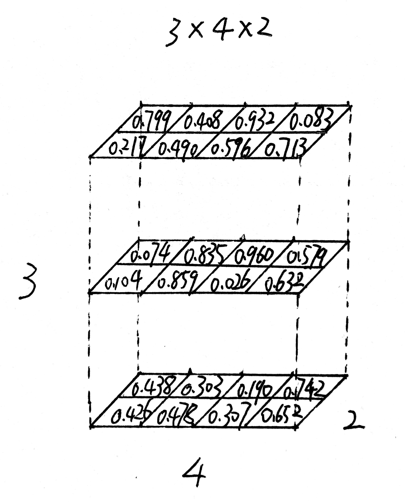
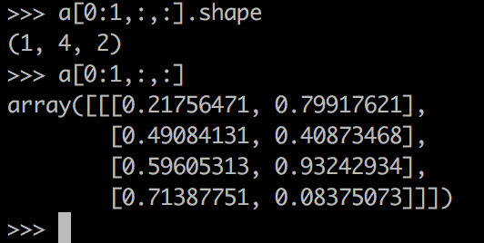
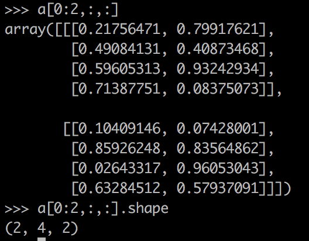
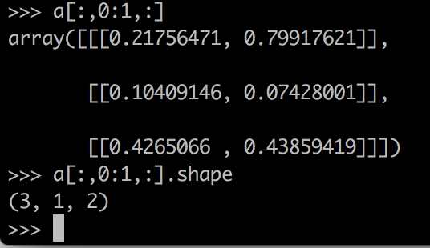
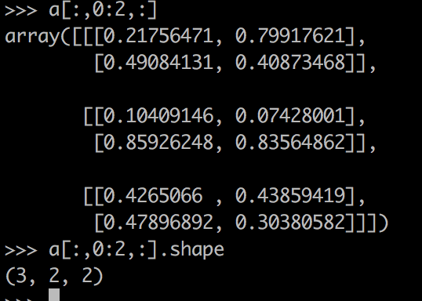
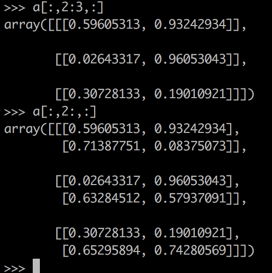
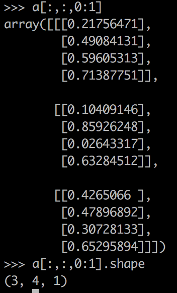
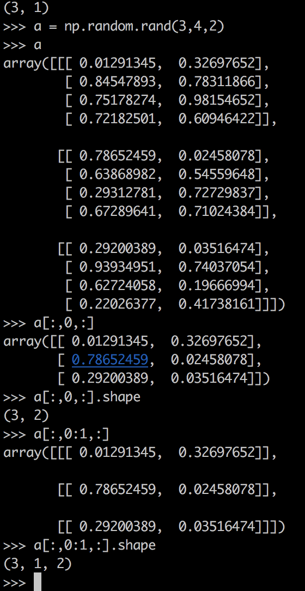

# Python 数组切片操作

MachineLearning 中会经常用到 Python 数组的切片操作（处理某几行某几列数据）。这里结合例子做一下总结。

例子：

维度为 $3 \times 4 \times 2$ 在 Python 中的表示： x 维度为 3，y 维度为 4，z 维度为 2.

 

**切片操作:**

原则： 冒号 “：”表示取全部值，数字表示截取的起始和结束的位置: 如0:1表示这个维度的位置0到位置1，1行或1列，0:2 表示 从0开始取2个，如首行或首列开始取2行或2列。

1. [0:1,:,:]

   说明：x 维度截取1，其他维度全部获得。shape(1x4x2)

   

2. [0:2,:,:]

   说明：x 维度截取 2，其他维度全部获得。shape(2x4x2)

   

3. [:,0:1,:]
   
   说明：x 全部，y 取1，z 全部。shape(3x1x2)

   

4. [:,0:2,:]

   说明：x 全部，y 取2，z 全部。shape(3x2x2)

   

5. a[:,2:3,:] 和a[:,2:,:]

   

6. [:,:,0:1]

   说明：x 全部，y 全部，z 取1。shape(3x4x1)

   

7. [:,0,:] 与[;,0:1,:]  区别：维度不同。

   

