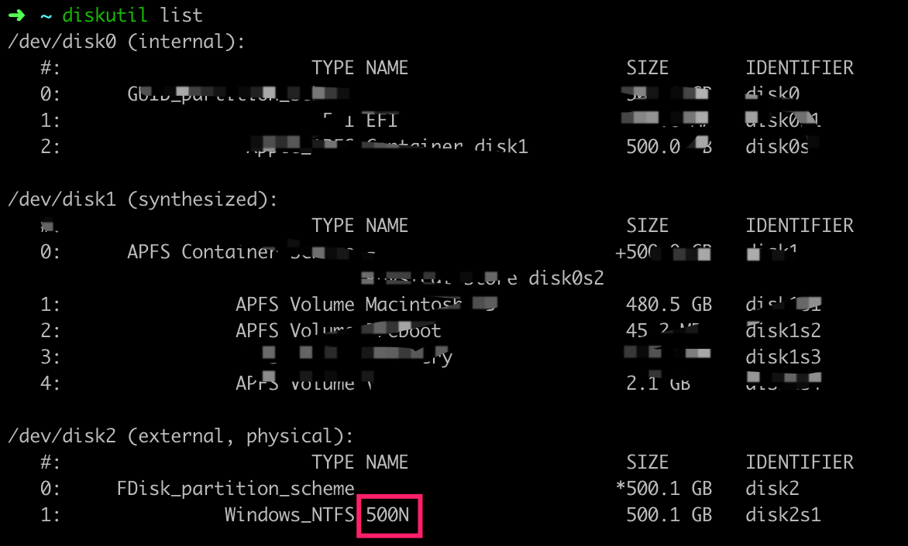
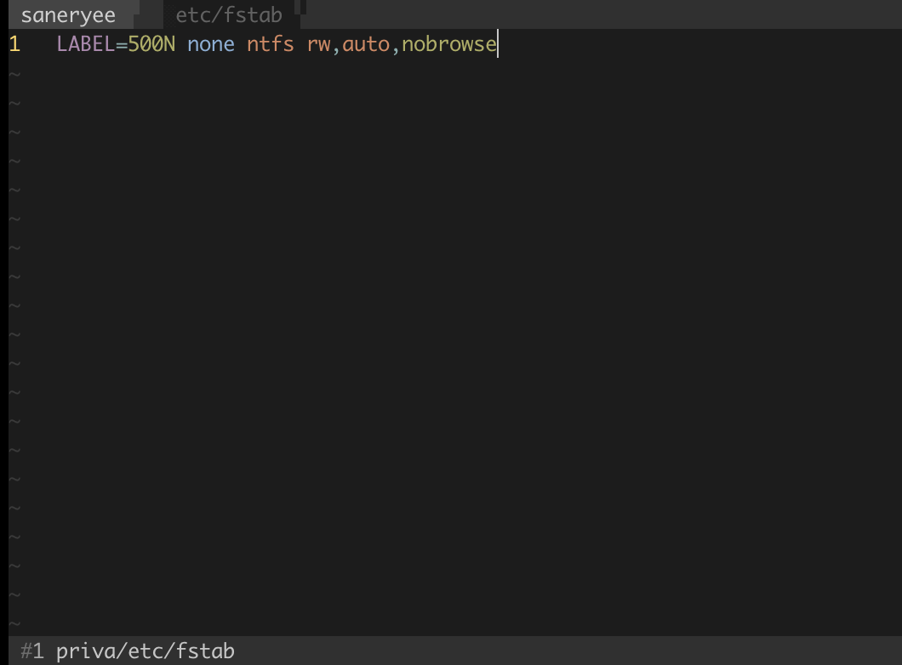
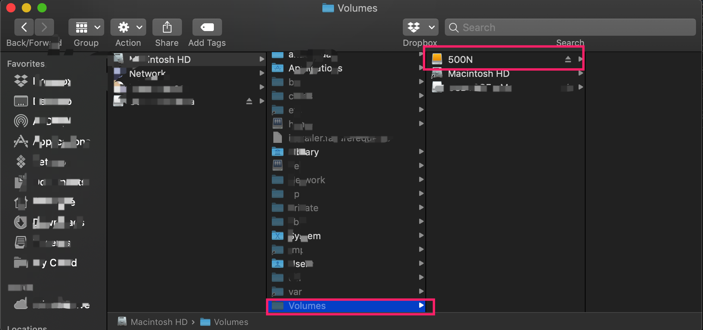
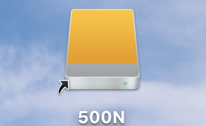

# macOS 直接读写 NTFS 格式的移动硬盘

除了使用工具外，MacBook 是可以直接读写 NTFS 格式的移动硬盘，只不过这里需要进行一些处理。

主要通过到修改 **fstab** 文件实现。

## fstab 文件介绍

[Wikipedia](https://en.wikipedia.org/wiki/Fstab) 中的简介如下：

The fstab (or *file systems table*) file is a system configuration file commonly found at `/etc/fstab` on Unix and Unix-like computer systems. In Linux it is part of the util-linux package. The fstab file typically lists all available disk partitions and other types of file systems and data sources that are not necessarily disk-based, and indicates how they are to be initialized or otherwise integrated into the larger file system structure.

The fstab file is read by the `mount` command, which happens automatically at boot time to determine the overall file system structure, and thereafter when a user executes the `mount` command to modify that structure. It is the duty of the system administrator to properly create and maintain the fstab file.

While fstab is still used for basic system configuration, for other uses it has been superseded by automatic mounting mechanisms.

可以看到 fstab 文件是 Unix 和 Unix-like 系统中关于文件系统配置的文件。 fstab 文件里列出了全部可用的磁盘文件分区和其他类型的文件系统和其他非磁盘数据资源，并指出如何将它们初始化或以其它方式集成到更大的文件系统架构中。
fstab 文件会在启动时被 `mount` 自动加载。

## 具体步骤如下：

系统：macOS Mojave version 10.14.4

1. 查看移动硬盘名称：
   
   打开终端，输入 `diskutil list`

   

   如图我这里的名字是 ***500N***，需要注意的是之前我的名字使用的是 ***N*** 结果不成功。

2. 修改 `etc/fstab` 文件
   
   终端输入 `sudo vi /etc/fstab`,然后输入系统密码。

   

   在 fstab 中添加 `LABEL=NAME none ntfs rw,auto,nobrowse` ,保存退出。
   
   命令格式

   ```vi

   Label = fs_spec fs_file fs_type fs_options fs_dump fs_pass

   ```

   其中：

   - fs_spec, NAME 就是在步骤 1 中查到的磁盘名称。

   - fs_file, 希望的文件系统加载的目录点，对于 swap 设备，该字段为 none

   - fs_type，该设备伤的文件系统，这里是 ntfs

   - fs_options, 特定参数选项。

      - rw 设备加载后可以读写

      - auto 启动时自动加载

      - nobrowse 在 finder 里不显示该分区。必须添加。

   - fs_dump 该选项被"dump"命令使用来检查一个文件系统应该以多快频率进行转储，若不需要转储就设置该字段为0(设置是否让备份程序dump备份文件系统，0为忽略，1为备份)

   - fs_pass　-　该字段被fsck命令用来决定在启动时需要被扫描的文件系统的顺序，根文件系统"/"对应该字段的值应该为1，其他文件系统应该为2。若该文件系统无需在启动时扫描则设置该字段为0

   

3. 重启机器，这时候桌面已经没有移动硬盘的图标了。可以看到实际移动硬盘加载到了 `/Volumes`  下。

   

   手动添加连接即可。打开终端输入 `sudo ln -s /Volumes/500N ~/Desktop/500N`

   

4. 这样每次插上硬盘，在桌面打开响应名称的图标即可。

   