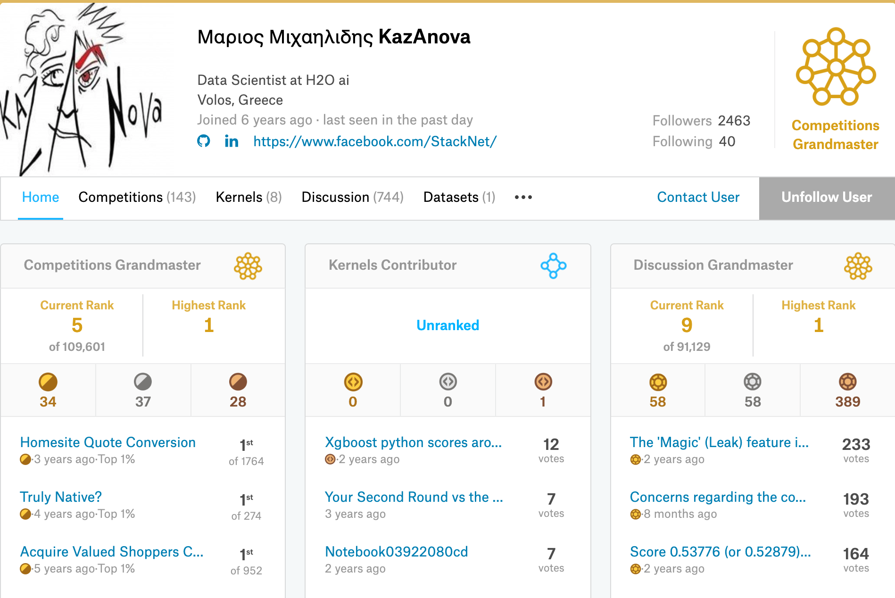
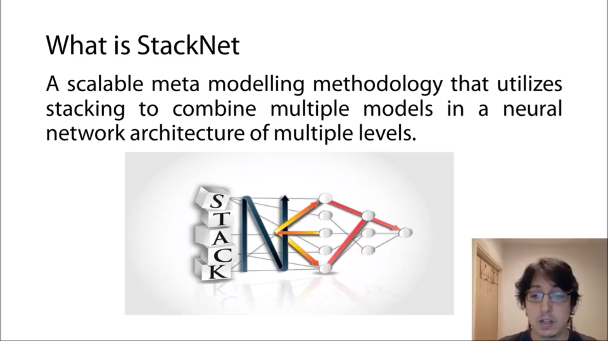
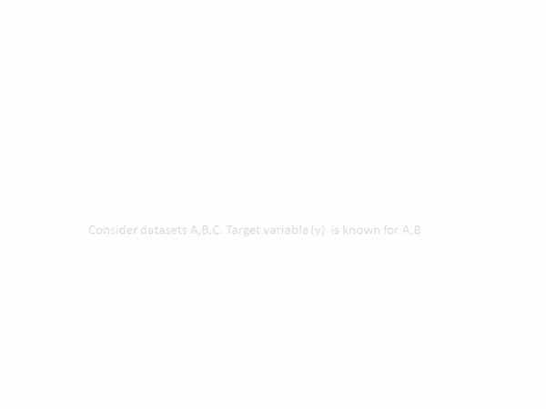
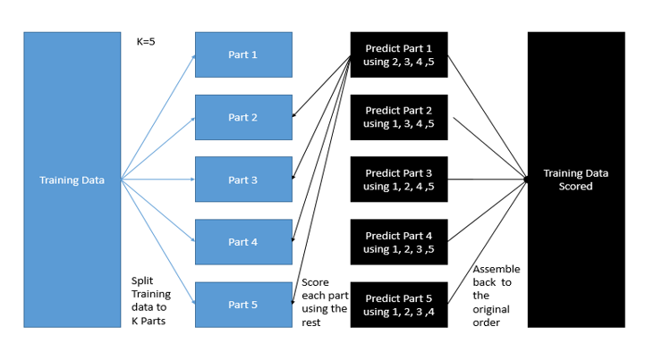
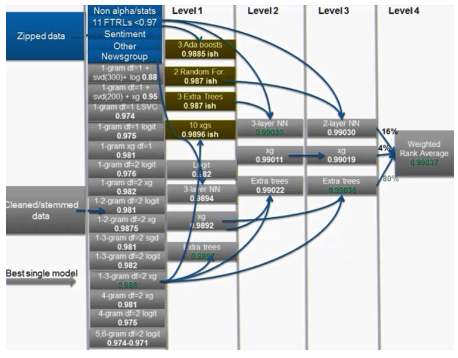

# StackNet

[https://github.com/kaz-Anova/StackNet](https://github.com/kaz-Anova/StackNet)

本文将介绍一款非常好用的 Stack 工具 StackNet。它是由 Kaggle 大神 Kaz-Anova 开发的。Μαριος Μιχαηλιδης KazAnova 的 kaggle 简介显示他是希腊人，Kaggle Competitions Grandmaster, 先排名第 5，历史最好排名为第一。

在 Coursera 的 How to Win a Data Science Competition: Learn from Top Kagglers 课程中也有请他专门来做 StackNet 讲解。就是下面这个帅哥。

## Stacking 原理

## StackNet 定义

>StackNet is a computational, scalable and analytical framework implemented with a software implementation in Java that resembles a feedforward neural network and uses Wolpert's stacked generalization [1] in multiple levels to improve accuracy in machine learning problems. In contrast to feedforward neural networks, rather than being trained through back propagation, the network is built iteratively one layer at a time (using stacked generalization), each of which uses the final target as its target.

可以看到 StackNet 使用 Java 语言编写，是一个计算，可扩展和分析框架。类似一个前馈神经网络并且应用 Wolper 的 Stack 泛化理论用于多层来提高机器学习的精度。与前馈神经网络相比，不是通过反向传播进行训练，而是一次一层迭代地构建网络（使用 stack 泛化），每个网络使用最终目标作为其目标。

## 模式

StackNet 的运行有两种不同的模式。

如图：

### Normal stacking mode 普通 Stacking 模式

第一种模式（默认）之前已经提到了，假设在每一层使用前一层的预测结果（或者输出的分数)

### Restacking mode 重新 Stacking 模式

第二种模式（也称重新 stacking）假设每层使用前一层的结果以及前面所有层的预测结果。

## K-fold 训练

## StackNet 一些注意事项

通常 StackNet 要优于单一模型，但是也要依靠表现良好的单个模型。

例如：

