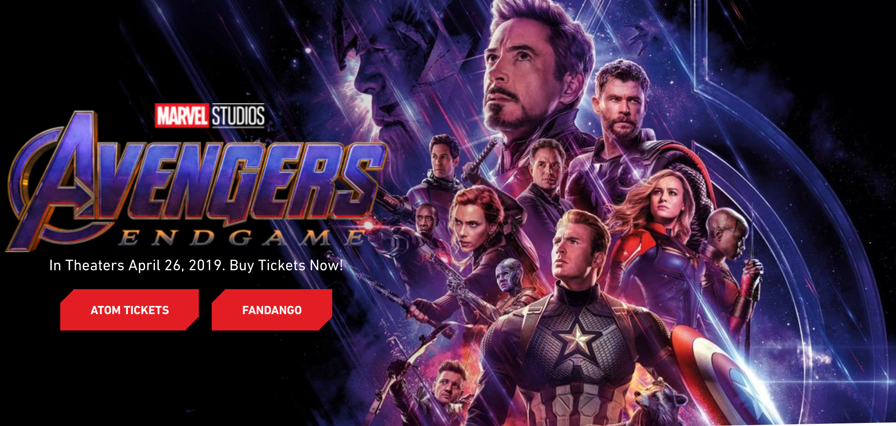
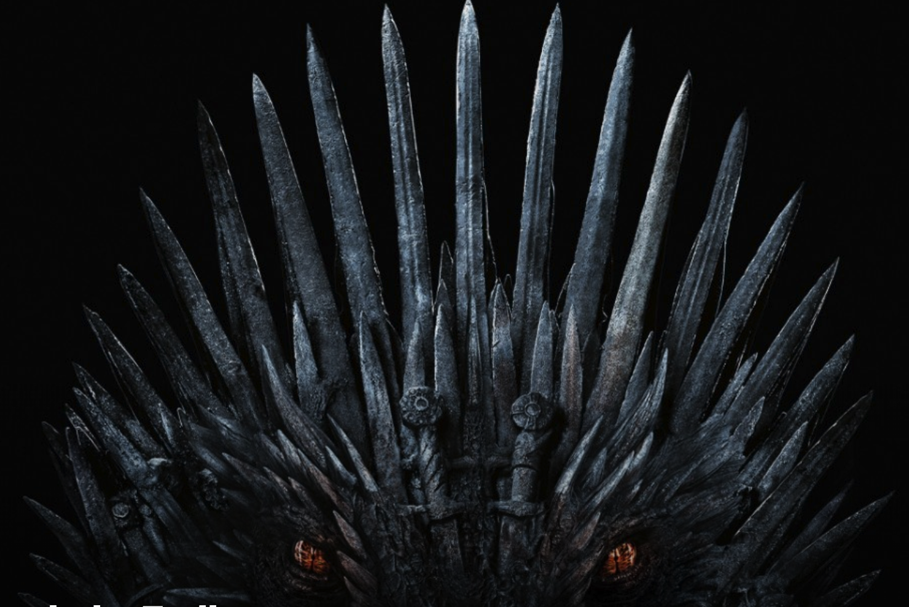

# The Avengers & Game of Thrones

本周初代复仇者联盟最后一部电影 *The Avengers 4 ： End game* 终于落下帷幕。

回望漫威电影的 11 年，不知不觉自己俨然成了一个漫威粉丝。追剧，追电影，剧终等彩蛋，俨然成为一种漫威文化。追溯自己的漫威史。复仇者联盟系列这 21 部电影以及美剧《神盾局特工》竟也基本看完。真如有些人说的，漫威把电影按电视剧拍了。其他的系列，如 X 战警， 神奇四侠等也一个不落。

刚开始自己也是分不清楚这些英雄，漫威宇宙是什么概念，更不知道背后的漫威漫画和 DC 漫画。仅有的美国漫画概念就是超人，蜘蛛侠和蝙蝠侠。

漫威之前，美国漫画在中国并不是很成功。最早的蝙蝠侠系列和超人系列也稍有佳作。漫画文化只是再很小的圈子中流转。就电影本身来说漫威这 21 部电影无论是剧本还是特效并不都是顶尖制作。但是漫威电影在票房上却取得了巨大成功。

就起原因，正如前面所说，漫威电影并不仅仅是电影。或者说漫威从开始就*在下一盘很大的棋！*

往往的电影或事系列电影，不过是《xxx I》，《xxx II》，《xxx III》的模式，各电影之间关联较弱。而漫威却将不同系列电影通过角色的共享，片尾彩蛋，事件共享等实现了强关联。甚至还实现了与电视剧如《神盾局特工》的关联。这就增加了观众的兴趣点，除了电影与电视本身艺术性之外，还增加了趣味性，观众对漫威宇宙的整体渴望增强，增加了漫威与观众的粘性和连续性。打破了电影制作周期长的局限。

同样，相反的另一个成功案例就是 *Game of Thrones*, 他是把美剧拍成了电影，每季甚至某集的制作都堪称一部电影。*Game of Thrones*  的成功我则归功于剧本与制作。

制作上无论是是主角，场景规模，数码特效，都超过了一般的好莱坞电影。剧本更有原著亲自操刀，表面上观众眼中的各个 “主角” 相继领盒饭，盒饭的数量和速度都超过了观众想象。正式这种对观众的各种*“虐”*，却牢牢抓住了观众。

虽然，这两部巨制都在 2019 年春终结，但是他们的成功还会继续。结尾有点草率，呵。

