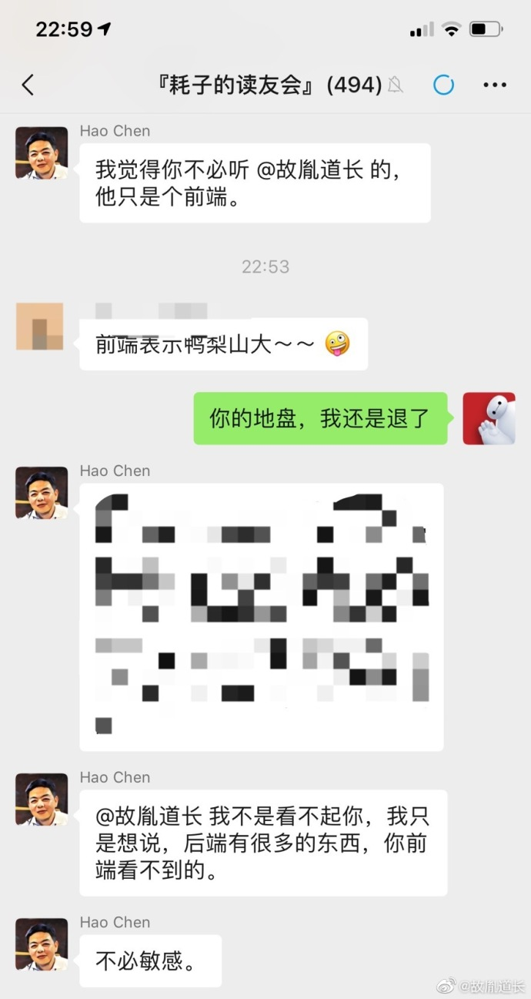

# 程序员・歧义・自尊心・自卑 - 观大牛“打架”有感。

2019-05-02

## 事件

今天在微博上亲眼看到一起“只是个前端”引发的事件。

事件的主角都是我关注的技术 “大牛”。

@左耳朵耗子 - 很早关注的一位全能大牛。

@故胤道长 - 《iOS 面试之道》作者。应该是在我钻研 iOS 时关注的。

事件的起因是如@故胤道长微博所述，两人在一个微信群（左耳朵耗子为主的群）的一段对话。@故胤道长的微博迅速引起大家的兴趣纷纷评论，这里各方很多小白粉丝的评论可以清楚的看出他们的立场，占住自己的立场“开骂”对方。当然也有很多我关注的其他大牛转载和评论，其中大部分也能看出对一方的支持。事件不出意外，各方的粉丝向着互相“扒皮”的阶段发展，好在当事一方@左耳朵耗子及时同@故胤道长进行沟通（*线下电话*）并在微博道歉，迅速平息了这场争端。

回顾这起*程序员小事件* 有很多地方值得我们思考。

## 思考

### 歧义的沟通

因为并不在事件发生的那个群，所以只能从微博上已有的信息分析。这件事可以说是因为双方在沟通中产生的歧义所引发的。首先他们的沟通方式是通过文字进行的，文字沟通很受程序员和不太善于语言沟通的人喜欢，这部分人不喜欢和人打交道，但是和机器打交道没有问题。所以他们主要的沟通方式就是通过文字。但是，文字沟通与语言沟通有一个很大的问题，就是**无法表达出说话者的语气**，同样一个字，一个词，一句话，带上不同的语气，表达的情绪和意义都会有很大的不同。如引起这件事的那句话“*他只是个前端*“，单看这句话的确带有些*贬低*的意思。而从@左耳朵耗子的解释，可以看到他更多的是在和@故胤道长调侃一下。这就在双方产生了歧义，沟通是低效的。

这给我的启示是：

沟通时尤其是使用文字沟通时，一定要注意你的文字是否会引起对方的歧义。如果无论你怎么调整措辞都不能消除歧义的话，最好还是换用语言沟通。从沟通效率来说，我认为语言大于文字，面对面语言交流大于非面对面语音（电话或微信）交流。然而，对一些人偏“内向”的人来说，他们不善于语言交流，我就是这样的人。这个问题我还没有很好的解决方法，只能有意多锻炼自己语言沟通表达能力。

### 自尊，自卑

从我个人的经历来说，我发现一个问题，就是*自尊*和*自卑*有着很奇妙的关系，也就是往往自尊心表现得很强的人，他们得内心却是有些自卑的，越是自卑的人，越在意别人对你的评价，对外越则表现出来得是自尊。也就说他们会表现的特别在意别人的话，开不起玩笑。有时你无心的一句话，都会引起他们很大得反感或愤怒。另外程序员的自尊心或者说做技术的人他们的自尊心都很强，你质疑其他什么，开其他什么玩笑都没事，但是你不能质疑我的技术，开我技术上的玩笑。我看到和我自己经历过很多起这样的事件。

所以，在沟通的时候，你要知道会有这样性格的人存在，即使是*很熟悉*的人。和他们沟通要多加注意，避免触碰他们的自尊心。

对我个人来说，后来我也是通过不断的“解放天性”和不断的“受虐”来不断提高自己的段位。可以自嘲的人，有时会得到更多的尊重。你也会活得更轻松自在。
