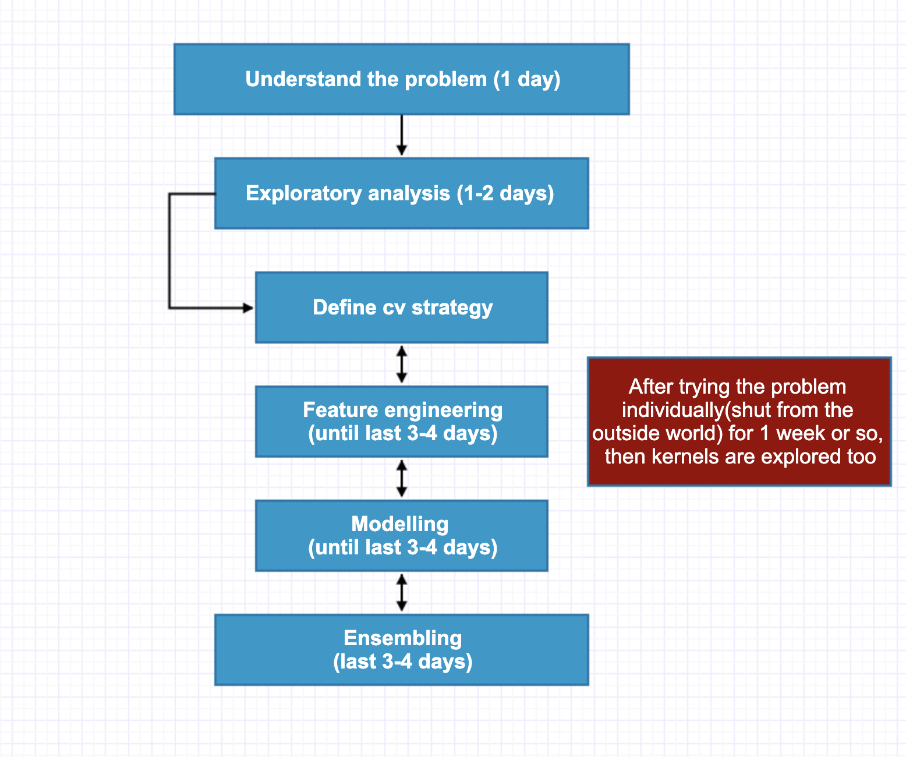

# KazAnova's competition pipeline, part2

Notes of Coursera - [How to Win a Data Science Competition: Learn from Top Kagglers](https://www.coursera.org/learn/competitive-data-science?)

[Part1](2019-05-05-Review-Week7-2019.md)

## Modeling

- The type of problem defines the feature engineering

- The typical dataset. Example tabular dataset boosting machines, sound classification - deep learning

- **Image classification**: CNNs(Resnet, VGG, densenet...)

- **Sound classification**: CNNs(CRNN), LSTM

- **Text classification**: GBMs, Linear, DL, Naive byes, KNNs, LibFM, LIBFFM

- **Time series**: Autoregressive models, ARIMA, linear, GBMs, DL, LSTMs

- **Categorical Features**: GBMs, Linear models, DL, LibFM, libFFm

- **Numerical Features**: GBMs, Linear models, DL, SVMs

- **Ineractions**: GBMs, Linear models, DL

- **Recommenders**: CF, DL, LibFM, LIBFFM, GBMs, xDeepFM

- Spend time within this validation strategy in order to find the best parameters.

## Ensembling (2-3 days)

- All this time, **predictions** on internal validation and test **are saved**.
  
  (If **collaborating** with others, this is the point where everyone passes on their predictions as .csv files)

  Every time you apply your cross-validation procedure with a different feature engineering and a different joint model, it's time, you saved two types of predictions, you save predictions for the validation data and you save predictions for the test data.

- Diiferent ways to combine from **averaging** to multilayer **stacking**.
- Small data requires simpler ensemble techniques (like averaging).
- Helps to average a few **low-correlated predictions** with good scores.
- Bigger data can utilize stacking.
- **Stacking process repeats** the modelling process.

## Tips on collaboration

- It makes it more fun.

- You learn more.

- You score better.
- You gain in at least 2 ways. First you can cover more ground. Second every person seizes the problem from different angles leading to more thorough solutions.

- Start collaborating after getting some experience (maybe 2-3 competitions) to understand the dynamics.
- Start with people around your "rank".
- Look for people that are likely to do different things well or that specialize in certain areas.

## Selection final submissions

- Normally select the **best submission locally and best on leader board**.

- It is good to **monitor correlations.** If correlations are too high and submissions exist with high scores but significantly lower correlations, they could be considered too.

## Final tips

- In these challenges **you never lose.** You may not win prize money, BUT you always gain in terms of knowledge, experience, meeting/collaborating with talented people in the field, boost your CV.

- Coffee is kind of a must when you do this!
- See it **like a game**... you have some tools ... or "weapons", you can get a score and you try to beat the "bad guys" score!
- **Take a break** often to rest you mind - do some physcial exercise as it is unhealthy sitting on chair many hours.
- The kaggle community may be the most kind, helpful community I have ever experienced in any social context.
- *After the competition* look for people sharing approaches.
- Create a notebook with useful methods and update it.
