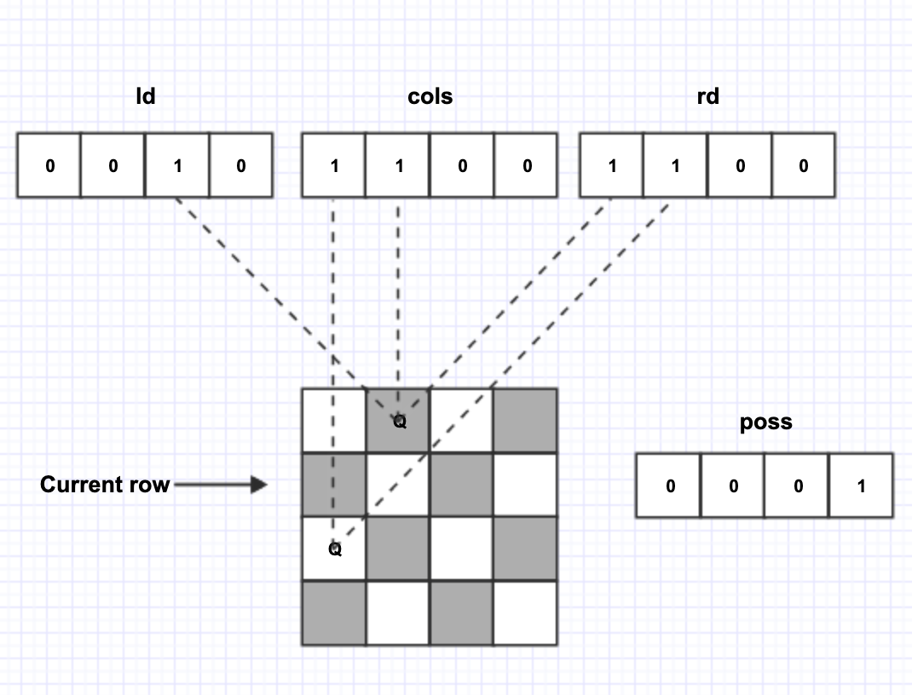

# LeetCode 52. N-Queens II

The $n$-queens puzzle is the problem of placing $n$ queens on an $n \times n$ chessboard such that no two queens attack each other.


Given an integer $n$, return the number of distinct solutions to the $n$-queens puzzle.

Example:

    Input: 4
    Output: 2
    Explanation: There are two distinct solutions to the 4-queens puzzle as shown below.
    [
    [".Q..",  // Solution 1
    "...Q",
    "Q...",
    "..Q."],

    ["..Q.",  // Solution 2
    "Q...",
    "...Q",
    ".Q.."]
    ]

Solutions:



Python3 Version:

```python
class Solution:
    def totalNQueens(self, n: int) -> int:
        if n < 1 : return []
        self.count = 0 # 记录结果
        self.DFS(n, 0, 0, 0, 0)
        return self.count

    def DFS(self, n, row, cols, rd, ld):
        # recursion terminator
        if row >= n:
            self.count += 1
            return

        # 得到当前行可以放皇后的所有空位
        poss = (~(cols | rd | ld)) & ((1 << n) - 1)

        while poss:  # 遍历当前行可以放皇后的所有空位
            p = poss & -poss  # 取得最低位的1，即最右开始可以放皇后的位置。
            self.DFS(n, row + 1, cols | p, (rd | p) << 1, (ld | p) >> 1)  # 当前位置放置皇后后，查看下一行哪些位置可以放皇后，递推到最后一行。
            poss = poss & (poss - 1)  # 去掉最低位的 1，即从当前行可以放皇后的所有空位除去已经验证的位置 p 后，继续循环其他位置。


s = Solution()

print(s.totalNQueens(4))

```