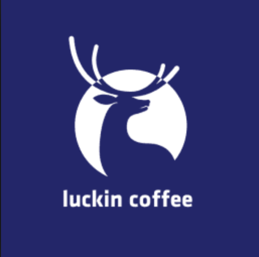

# 再谈 Luckin Coffee

之前在 [Week2 的 share - 线上线下连锁咖啡店闲谈](https://github.com/gsaneryeeb/ARTS/blob/master/2019-03-29-Share-Week2-2019.md) 里分享过一些对 Luckin Coffee 的看法。 

上周 Luckin Coffee 成功在 Nasdaq 上市。并且在当前极不稳定的市场环境下，第一天交易收盘时较开盘价涨了进 20% 。随着成功的上市，一些有关 Luckin Coffee 的细节和观点也占据了周末的一些热点。观点褒贬不一，其中一些新词的出现，也让我涨了见识，比如 *to CV 公司*， *to 股民公司*， *to IPO 公司* 等等。 传统互联网公司有 2B （to business）， 2C （to customer）等模式，定义了公司主要与谁做生意，为谁服务，从谁哪里获取利润。 而 *to CV 公司*， *to 股民公司*， *to IPO 公司* 则是一种调侃，就是说公司主要从 CV （风险投资），股民，IPO 等处赚钱，这样的公司在新兴的创业公司中比比皆是。而 Luckin coffee 用了 18 个月的成功上市，更将这一模式推向了高峰。

高峰过后，必然是低谷。看过几篇分析之后，你会发现。他们把 Luckin Coffee 的 “成功”， 归结于营销，战略，投资，促销，推广等等。恰恰少了最重要的一点，**Luckin Coffee 是不是好喝？**，从我自己的体验来说 Luckin Coffee 不是如她宣传的那样好喝，她的口味只是与她的定价（促销后的价格）相符。从微博博主和周围朋友的反馈来说，一部分人觉得 Luckin Coffee 不好喝，不会再买；一部分对口味不敏感（只要比 costa，麦当劳，速溶咖啡好喝就可以）， 她们只在乎价格，只要有 低于 5折的优惠，她们就会再购买； 还有一部分人是跟风和尝新；真正因为好喝，爱喝再次购买的人几乎没有。

读 MBA 时老师曾说过，现在开公司与以前不一样。以前开公司创业者会把公司当成自己的孩子，一点点看着他长大，如果从他们手里夺走公司（投资，并购等行为），他们会很难受。他们开公司多是为了是想自己一个“理想”，像养孩子。而现在一些创业者开公司的目的就是为了今后能把它买了。这些人开公司就像养猪。他对公司所做，所有决策，都是为了把他养“胖”，养“肥”，能卖个好价。

两者无所谓好坏，这是理念与目的的不同。但是对于消费者来说，如果你的东西不好，你做的一切努力不是为了满足我的需求的话，我是不会为你买单的。

说到口味，我原来有一个疑问？ *是否一家公司可以比星巴克更低的价格，提供一样品质的咖啡呢？* 罗永浩在自己公司内部做过这样的尝试，一些国内和国外的咖啡店都能提供比星巴克好喝的咖啡，但是价格不会比星巴克便宜多少，或者有些更贵。最初以为 Luckin Coffee 会是这样一个理念，这样一个咖啡店。但是现在来看他并不是，而且越走越远。所以这样的公司没有出现，或者说这样的公司也不会出现。星巴克已经把这种模式做到了极致，对于星巴克咖啡来说这个价格也是成本多次平衡的结果。

所以呢，对我来说喝咖啡远离 Luckin Coffee，炒美股远离 Luckin Coffee。 还是自己手打一杯咖啡吧。