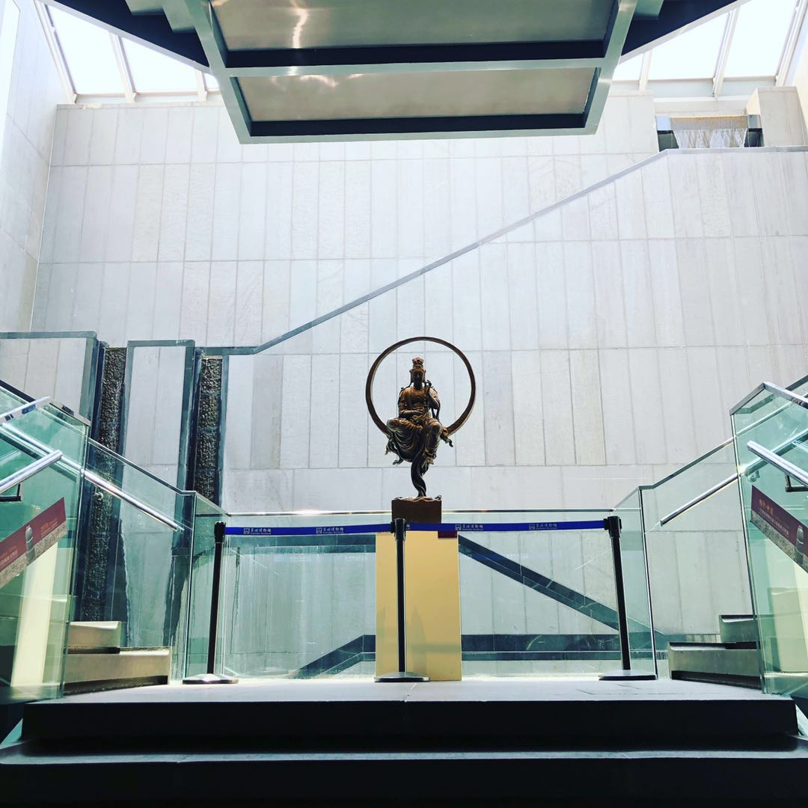
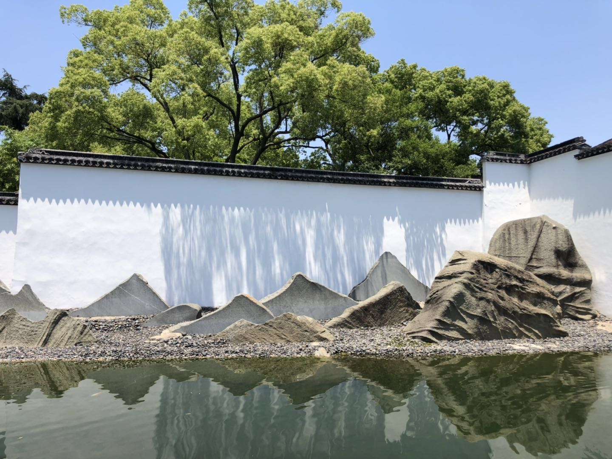
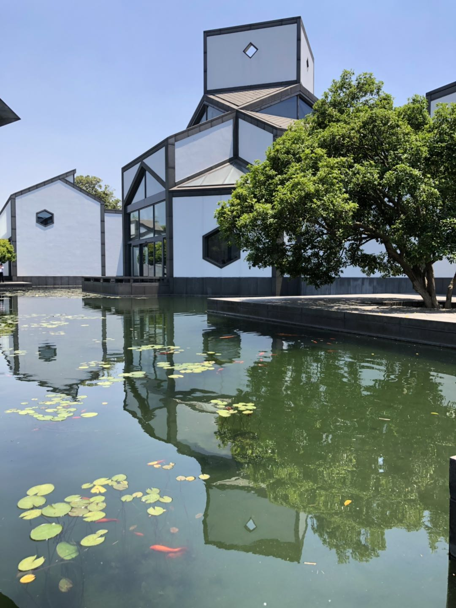

# 建筑设计与计算机架构

上周休假到苏州游玩了一周。儿时在课本中就读过苏州园林 - 拙政诸园，直到上周才真正来到拙政园。之前也到过江南的一些园林和北京的皇家园林，直到来到拙政园，你才能体会到她是名副其实的中国园林 - 万园之母。各家园林的设计都能从她中找到源头。

曾经听说过，真正建造和设计中国园林的都是当时的画家和文人，也就是艺术家，并不是工程师。 而工程师只能造出来长城，却造不出园林。总有体会不论是建筑还是绘画或是软件硬件，真正的美物，必是那些“艺术家”造出来的。这里不得不说 Apple 与 Microsoft 和 Google， Apple 就像是艺术家而 Microsoft 和 Google 则是工程师。从他们的产品我们很容易看到各自的痕迹。工程师造物是能用，而艺术家造物是美。

美感正是大多数 IT 工程师所缺少的基本素质。代码写的不美，程序结构不美，系统架构不美，软件设计不美，不美充斥着方方面面。

欣赏古代园林之余，也参观了现代设计大师贝律铭的作品“苏州博物馆”。置身之中凝视每一步 的景观，都呈现出一种美。设计师始终追求的就是一种美，大到建筑外观的设计，小到一竹一石的选择，都体现了设计师对美的追求。

大师门善于运用各种资源与技术，然后呈现给大众一个美的设计。庸才则只会一些功能的堆砌，毫无美感。感谢这些大师的设计，这些艺术家对美近乎偏执的追求。

也许美感是人工智能最难的实现，艺术是人工智能永远达不到的人类顶峰。

