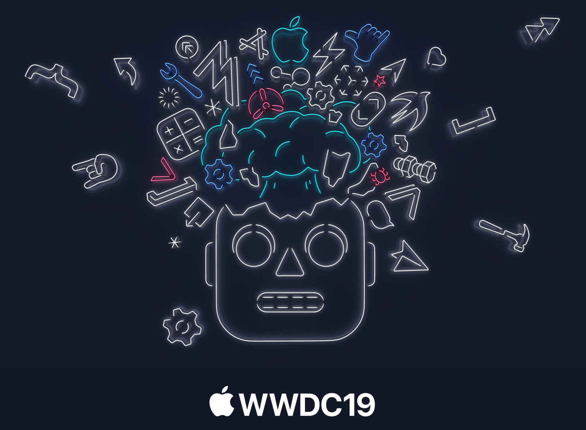
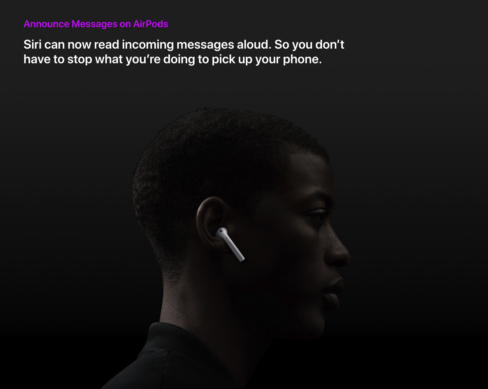
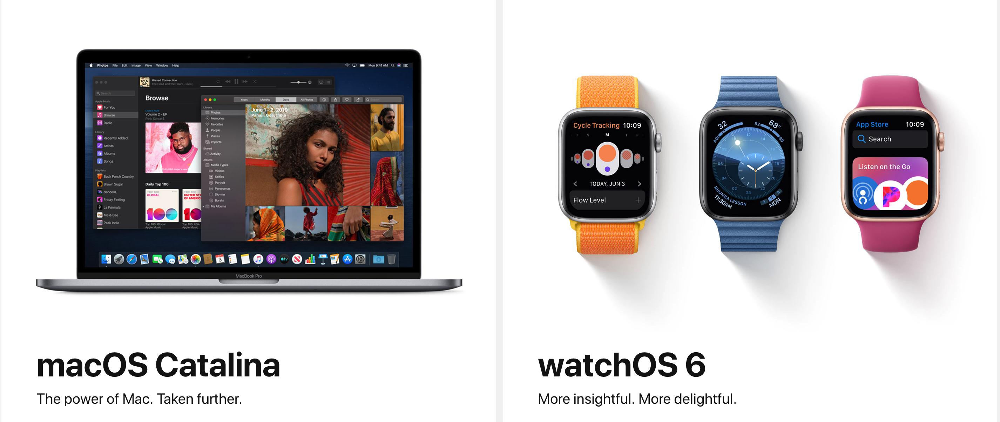
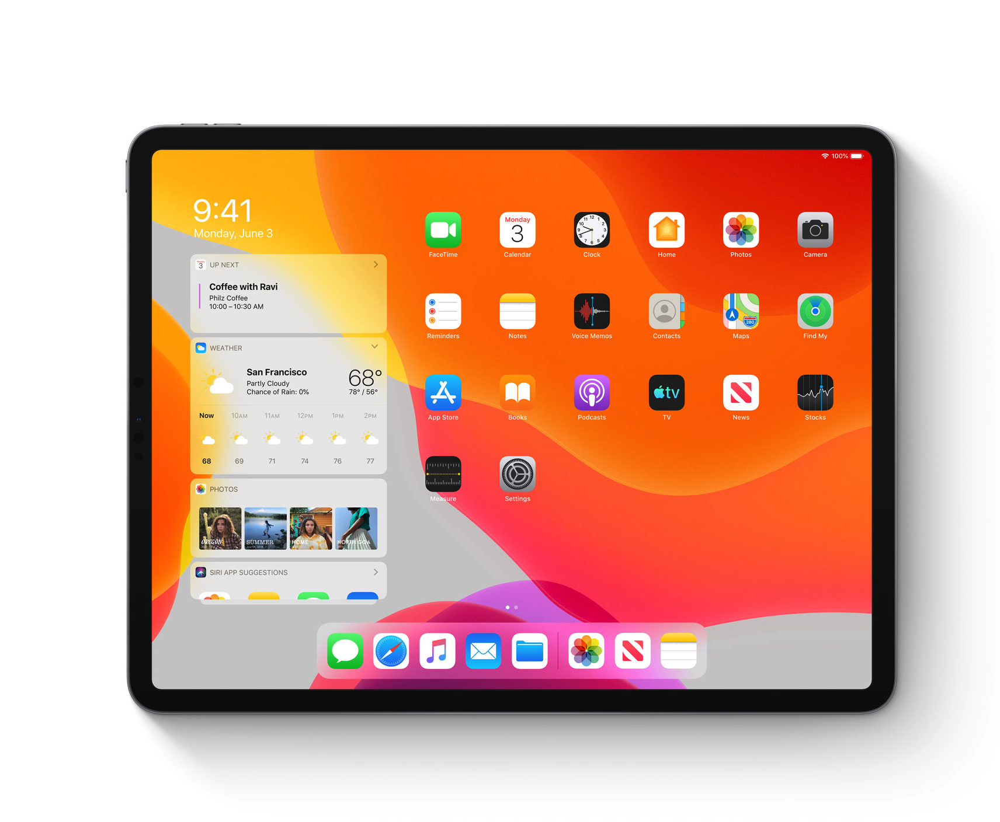
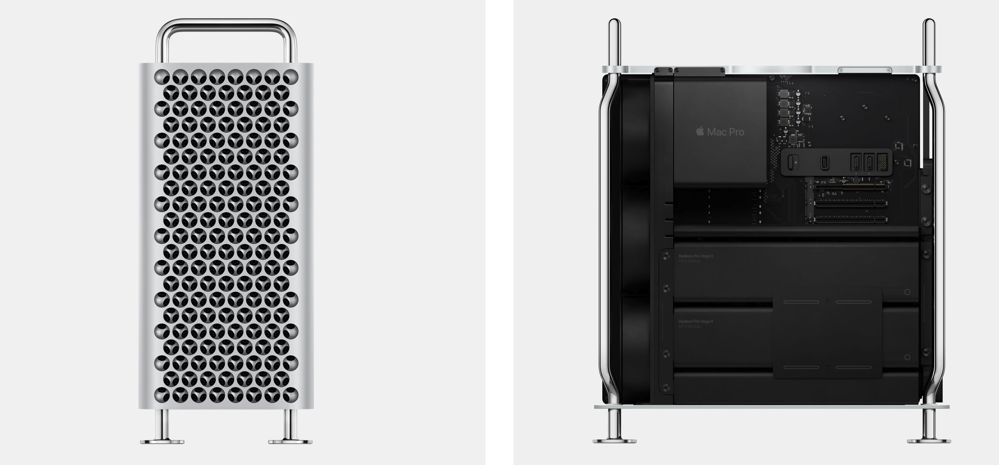
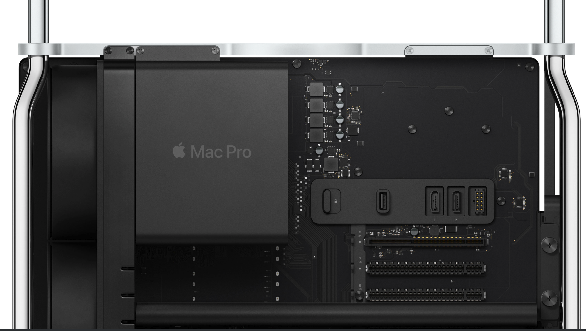

# WWDC 2019 观感

本周二 WWDC 2019 在 San Jose Convention Center 拉开序幕。相较 Apple 每年其他的发布会，每年的 WWDC 还是最令我期待的。WWDC 尽管有时并不发布硬件，但是它确是每年 Apple 对自己生态的一次全面详尽的展示。

如果你要客观评价或者对新产品有更直观的体会，一定要看完整场 Apple 发布会，而不是去看媒体为你总结出得发布会要点和其他人的各种吐槽。

今年的 WWDC 从硬件和软件对 Apple 生态做了一次完整展现。首先在生态的软件框架上，Apple 对主要系统都进行了升级这其中包括 **iOS 13，watchOS 6， macOS Catalina** 同时还推出了 **iPadOS**。硬件方面发布了全新的 **Mac Pro** 以及顶级显示器 **Pro Display XDR**。

## iOS， WatchOS，macOS

**iOS** 的更新依然是一次完善生态圈性质的升级，总体架构并没有大的变化。Siri 依然在不断的长大，AirPods 可以问你读出信息。钢铁侠的 Jarvis 离我们不远了。AirPods 和 Apple Watch的出现已经慢慢的的将我们与手机和电脑甚至整个网络融为一体，暨人与机器的结合体。 Elon Musk 也提到过这样的人工智能是他希望的方向。

Photos，Camera，Memoji 等一些 App 的更新，Cycle Tracking 的推出，都在延续 Apple 的生态战略。Apple 不断从 Apple 生态中汲取其他公司的创作灵感，或 “抄袭” 或购买不断将这些优秀的灵魂融入到 Apple 的核心中。一个公司或者一个独立开发者从进入 Apple 生态那天起，其实就已经将自己的灵魂交给了 Apple。这无所谓正义与邪恶，这更像是一种共生。有些领域中如系统级 App，效率型 App 等，一些好的创意注定会被 Apple 官方应用所取代，这点开发者一定要清楚。

## iPad OS

这次大家没有想到的是，Apple 推出了相对独立的 iPad OS。之前大家都在讨论 iOS 与 macOS 的走向，一部分人的观点是 macOS 会被 iOS 所取代。但是现在看来 iOS 与 macOS 还是在相对独立的道路上演化，iPad OS 更像是两个系统之间的粘合层系统。iPad OS 与 iPad 的产品战略紧密相连。 iPad 既可以独立作为娱乐和轻量办公平台还可以作为 Mac 的第二屏或者触控屏幕使用。这就是为什么 Apple 不推出可触控的 Mac，因为 iPad 负责完成这个功能。iPad 在移动和触控已经非常完美，把它与 Mac 结合使用是最佳的策略。

## Mac Pro & Pro Display XDR

尽管网上有不少人吐槽 Mac Pro 和 PRO Display XDR 的外观和价格，但是我要说的 Mac Pro 和 Pro Display XDR 处理是性能卓越的服务站和专业监视级显示其外，还是一件艺术品。大部分时间我们觉得艺术品是绘画，音乐，建筑，电子产品很少会出现艺术品，在我的眼里 Apple 的这两款产品就是艺术品，当然 Apple 很多产品都称得上是艺术品，如 iPhone 5，Macbook Pro，Macbook air， “垃圾桶”，iPod系列。正如我 [建筑设计与计算机架构](https://github.com/gsaneryeeb/ARTS/blob/master/2019-06-02-Share-Week11-2019.md) 这篇文章提到的观点。计算机领域硬件中 Apple 的设计体现了艺术的美感，这种美感不只在外观设计，Mac Pro 内部主板，硬盘，显卡等的设计都体现出了一种美感。可以说其他品牌的的计算机是机器，Apple 的计算机除了是机器外还是艺术品。如果一个竞争对手的竞争优势上升到艺术和美学的水平，他在一定时期内就是无敌了。

惊喜连连，Apple 产品值得拥有。

