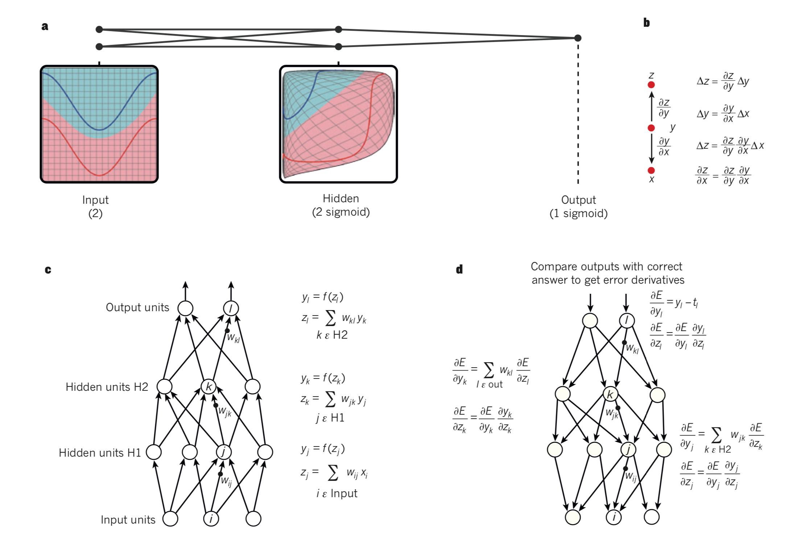

# Review of Deep learning by Yann LeCun, Yoshua Bengio & Geoffrey Hinton

## Supervised Learning

- Stochastic Gradient Descent (SGD)

  

- Deep-learning architecture:
  - sensitive to minute details
  - insensitive to large irrelevant variations such as the background, pose, lighting and surrounding objects.

## Backpropagation ton train multilayer architectures

- History of backpropagation

- poor local minima are rarely a problem with large network

## Convolutional neural networks

- ConvNets are designed to process data that come in the form of multiple arrays.
  
  - 1D: signals and sequances,including language
  
  - 2D: for images or audio spectrograms;

  - 3D: for video or volumetric images(CT, MRI)

- Four Key ideas behind ConvNets:

  - local connetctions

  - shared weights

  - pooling 

  - the use of many layers

- Convolution layer: detect local conjunctions of features from the previous layer

  - architecture: feature maps and filter banks

  - local groups of values are often highly correlated

  - the local statistics of images and other signals are invariant to location.

- Pooling layer: merge semantically similar features into one.

- higher-level features are obtained by composing lower-level ones.

  - Images: local combinations of edges form motifs -> parts -> objects

  - Speech & text: sounds to phones, phonemes, syllables, words and sentences.

## Image uderstanding with deep convolutional networks

- dropout and techniques to generate more training examples by deforming the existing ones.

- ConvNet-based vision systems

- ConvNet Chips

## Distributed representations and language processing

## Recurrent neural networks

- speech and language

- 'Translate' the meaning of an image into an English sentence

  - Encoder: a deep ConvNet, converts the pixels into an activity vector in its last hidden layer.
  - Decoder: an RNN 

## The future of deep learning

