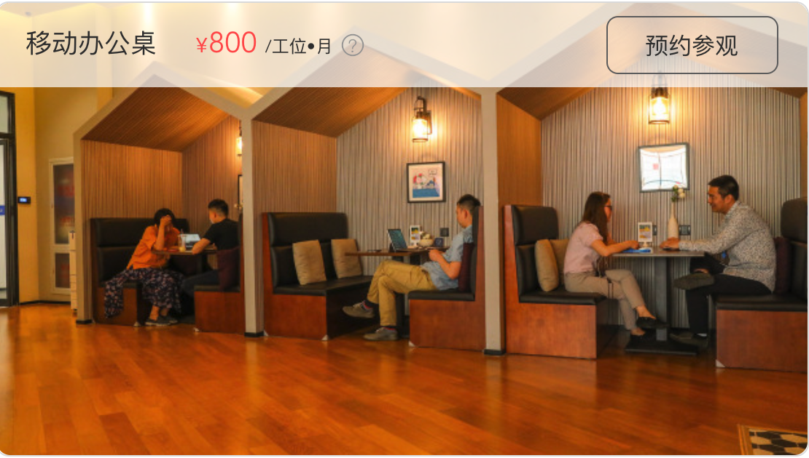
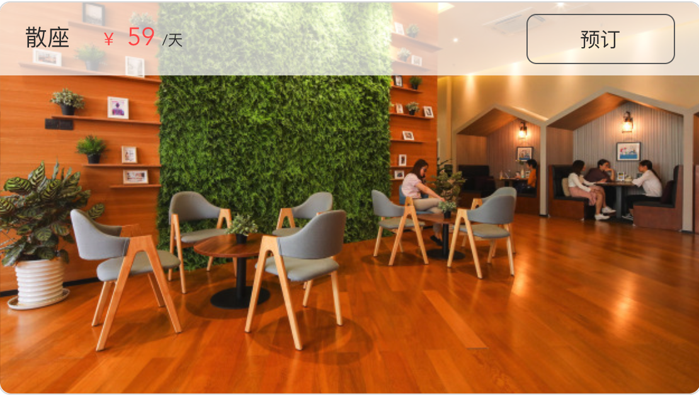
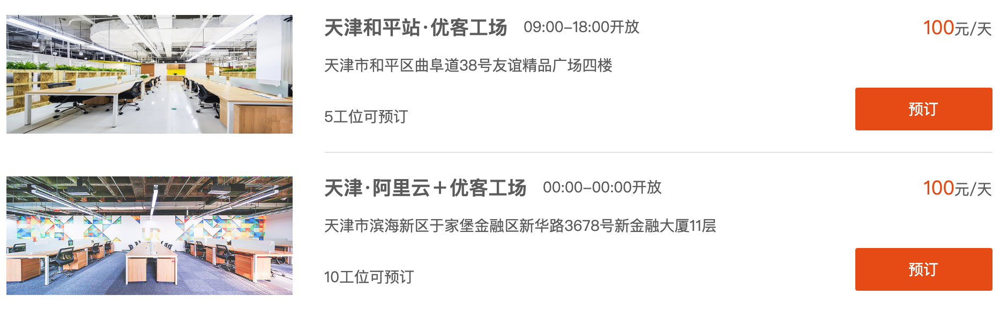
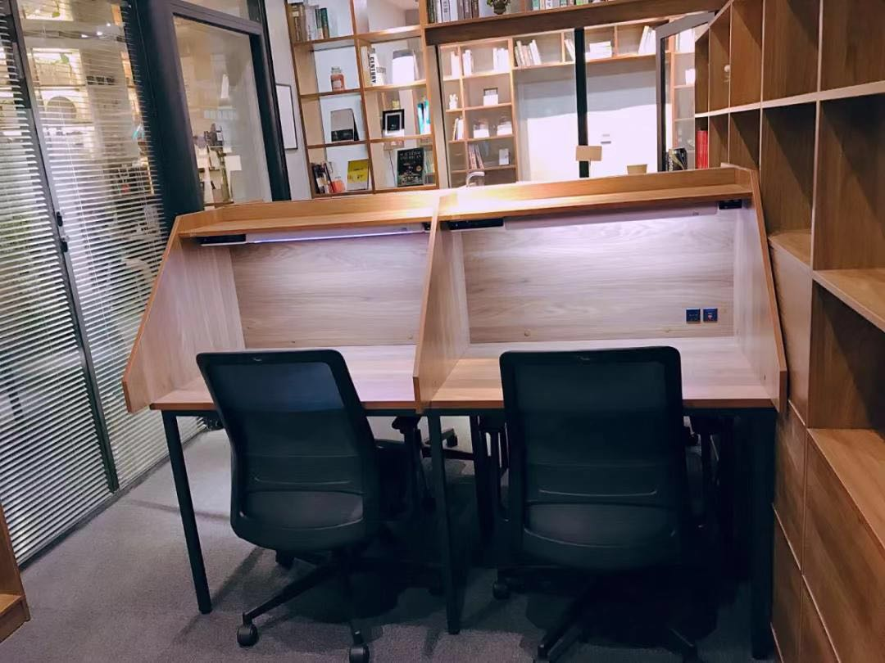
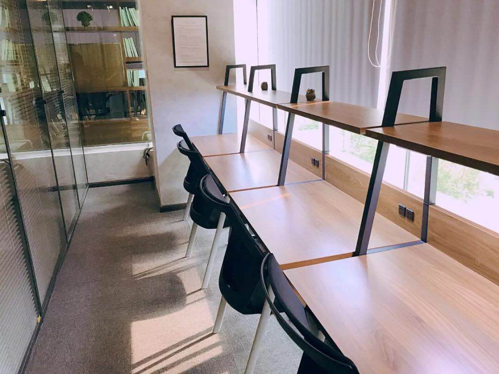

# 去哪里 Remote

最近工作主要以 remote 为主，大部分时间可以在家里的 lab 工作，但是有时候还是需要外出 remote。最初我会选择 Starbursts 来远程工作。但是现在 Starbucks 的环境越来越不适合远程工作。座椅不舒适，环境嘈杂，等等。

其他的咖啡馆或者图书馆也不能保证提供适宜的工作环境，所以也开始考虑联合办公的方式。联合办公以 wework 最为著名，现在也开到了国内。国内类似的有氪空间，优客工场等。除此之外还有一种类似联合办公但是规模较小的自习室模式。

现在比较一下这几种远程工作的方式，以我所在的天津为例：

1. 环境

   **WeWork**

   **移动工位**   
     
   **固定工位**  
    

   **氪空间**

   **移动办公桌**  
   
   **散座**  
   

   **优客工场**  

   **时租工位**  
    

   **STUDYHAUS嗨书吧**
   
   **半场开式**  
   
   **敞开式**  
   
   
   可以看到书桌和较为舒适的椅子是标准的配置，照片显示的是各自主打的标准工位的情况。而且各个空间根据不同价位提供了不同的环境配置。如：显示器，高档工学桌椅，护眼灯等选择。联合办公模式租赁的空间比较大，可以容纳人数较多，但是带来的问题，可能是不能保证相对环境的安静。自习室给我们带来很多亮点，但是她的缺点是空间相对紧凑一些。比较适合个人 remote。

2. 价格

   - 优客工场：敞开式工位的价格是 100 元/天 (09-18)
   - 氪空间：移动办公桌 800元/月， 散座 59 元/天
   - 星巴克：30 ～ 100 元左右/天 （咖啡+小食）
   - 自习室：敞开式 43元/天（09-16），1088元/月；半敞开式 53元/天（09-16），1388元/月

   价格上 wework 暂时在天津没有工作场所。其他几家以工作日 09-18 来算的话，针对个人 remote 来说，自习室有比较明显的优势。

3. 地点

   基本所有的联合办公或者自习室都选择了市内公共交通较为方便的商业中心。

4. 其他

   这些办公场所一般还会提供：免费或额外付费的打印，茶水咖啡，小食，轻食等服务。

对于我个人来说，如果随时随地（全国范围内）的办公的话，首选还是星巴克这样相对安静的咖啡厅。其次对于固定的 remote 来说，自习室是不错的选择。而对于小团队（4-10）人来说，选择一个联合办公场所更适合一下。

可能联合办公、remote 办公对于国内很对人，或者公司来说还过于超前。看到相关报道这几家联合办公在今年（2019）也先后出现了资金紧张，裁员等问题。联合办公一次投入较大，商业中心的房租负担很重。自习室相对投入较小，但是已我去过的这家来说，每天的出租率也不是很高大约是 3-5 成左右，因为自习室主要针对个人用户，在各大考试（中高考，司法，会计等资格考试）前夕的出租率会高一些，能到 70%-80% 的水平。对于小投资者来说，投资自习室还是不错的项目。而对于联合办公来说，希望他们能够坚持下去，争取能迎来 remote 的热潮。

总之，对于个人 Freelancer 来说自习室是个不错的选择。

