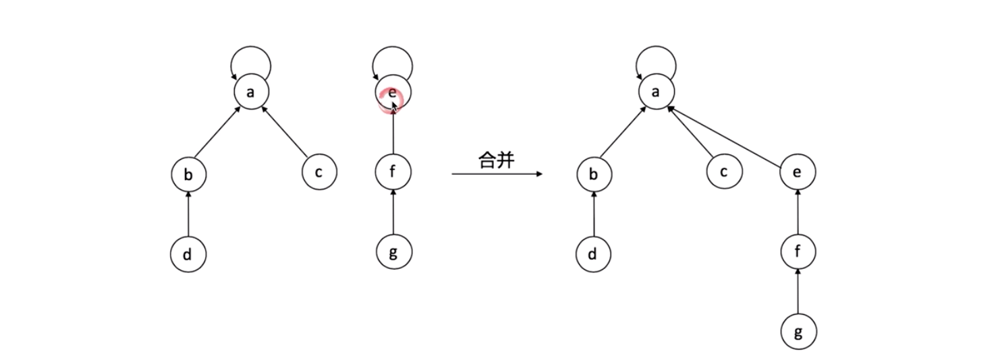
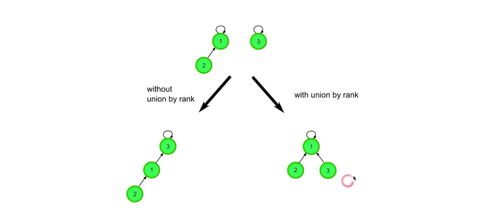
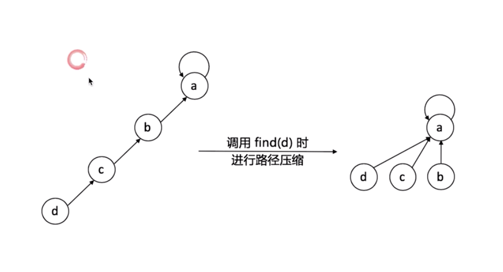

# 并查集 (Union & Find)



## 并查集应用

- 小弟 --> 老大
- 帮派识别
- 合并的两种优化方式
  - with union by rank  
    
  - 路径压缩
    


## 实现

Java Version

```java
public class QuickUnionUF{
    private int[] roots;

    public QuickUnionUF(int N){
        roots = new int[N];
        for (int i = 0; i < N; i++){
            roots[i];
        }
    }

    private int findRoot(int i){
        int root = i;
        while (root != roots[root])
          root = roots[root];
        while (i != roots[i]){
            int tmp = roots[i]; roots[i] = root; i = tmp;
        }
        return root;
    }

    public boolean connected(int p, int q){
        return findRoot(p) == findRoot(q);
    }

    public void union(int p, int q){
        int qroot = findRoot(q);
        int proot = findRoot(p);
        roots[proot] = qroot;
    }
}
```
