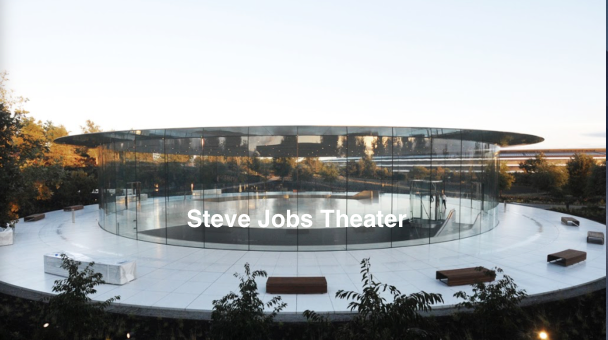
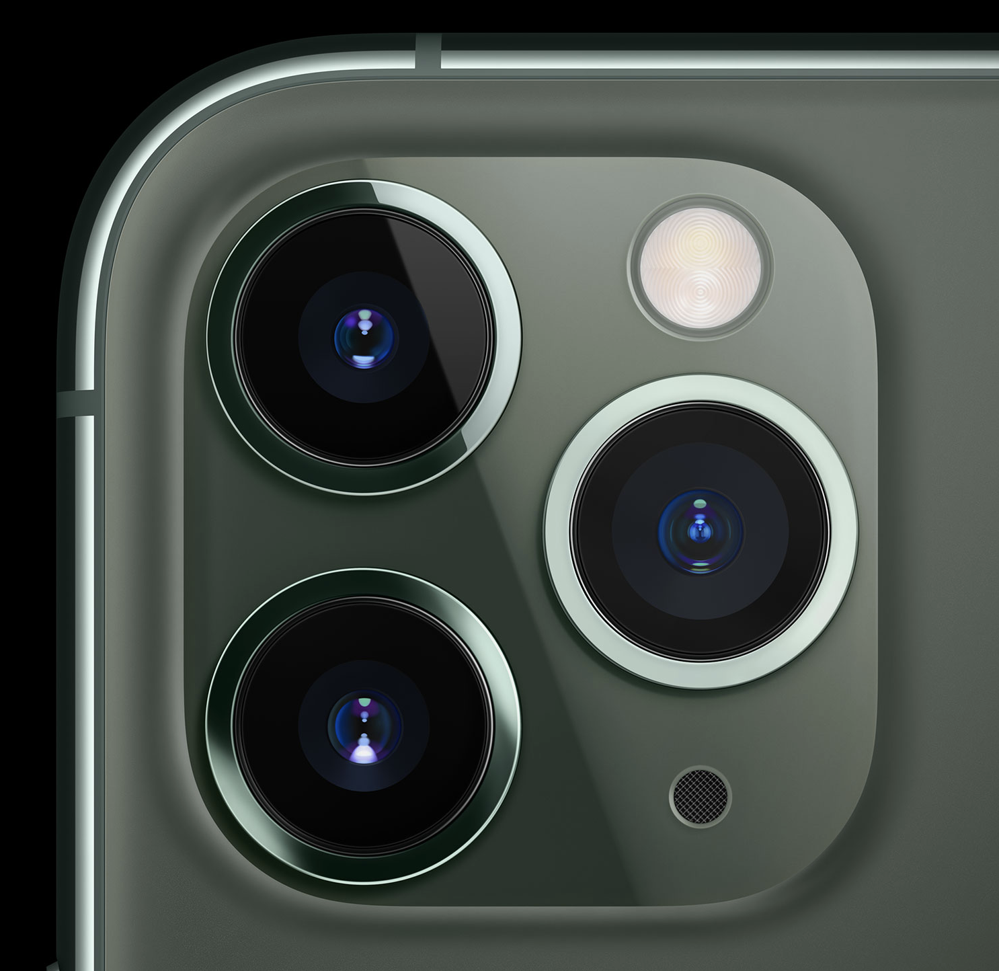
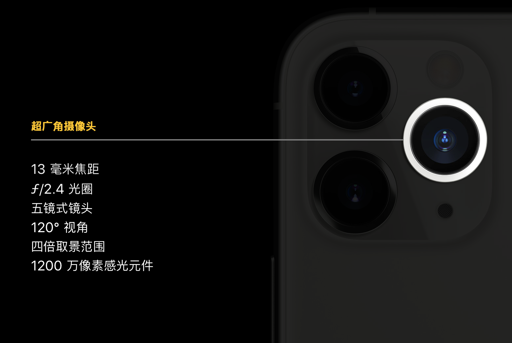
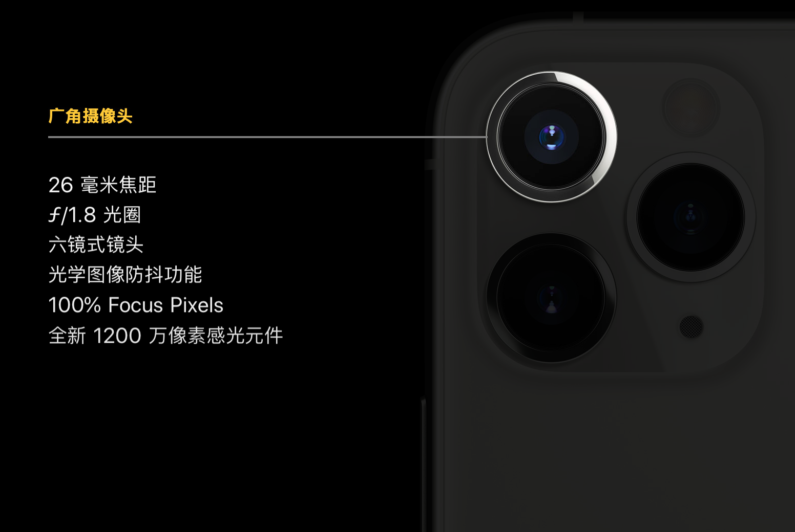
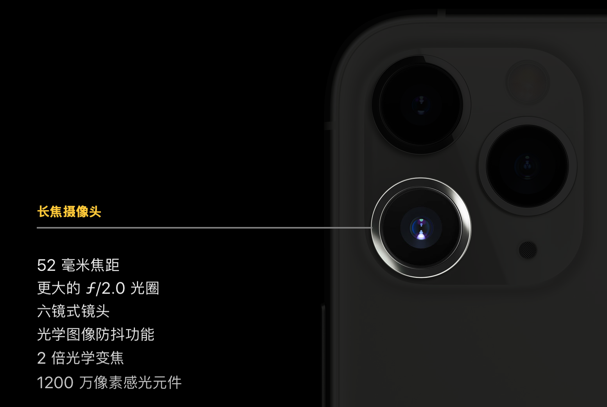
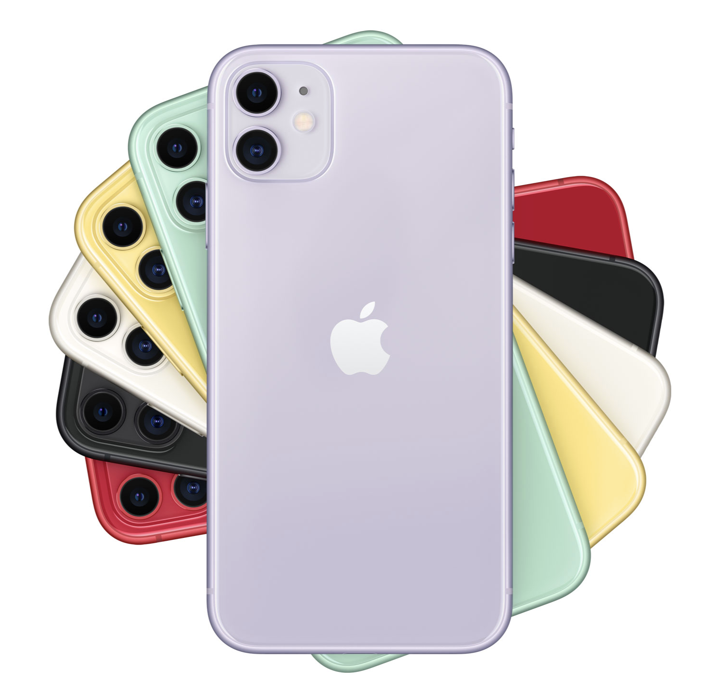
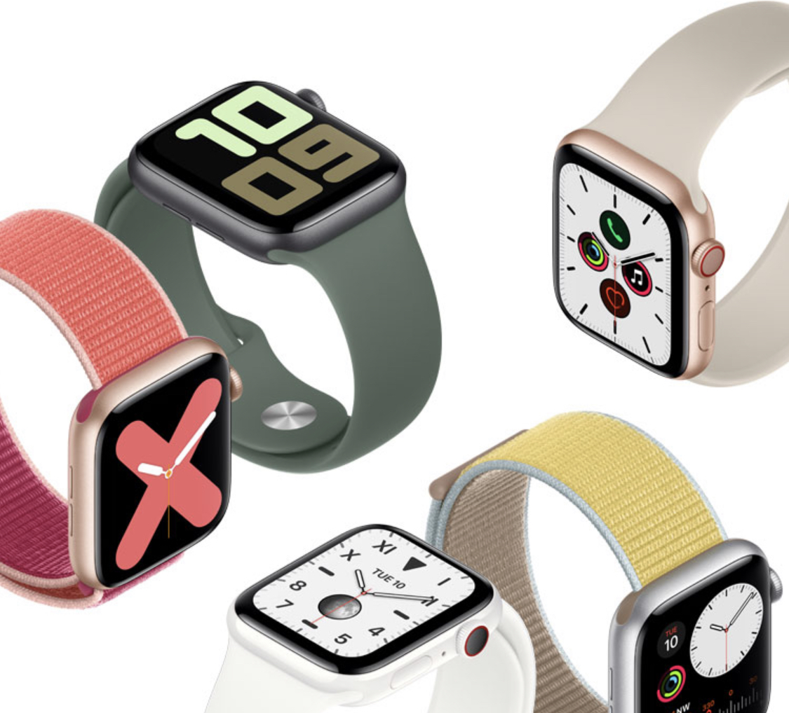
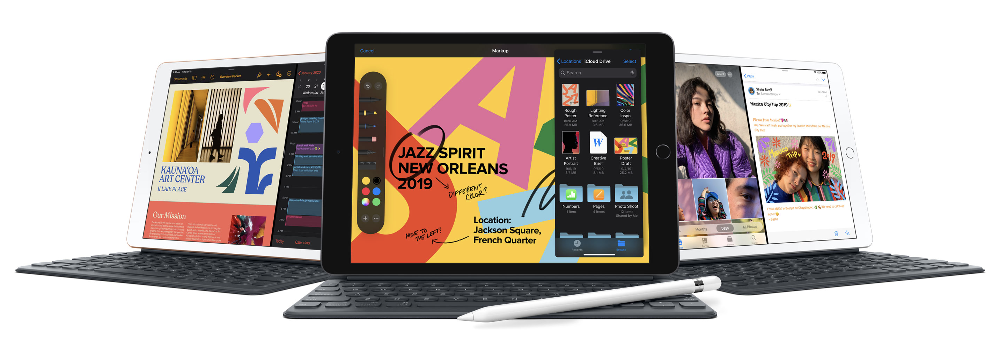

# Apple 秋季产品发布会

北京时间昨天凌晨 Apple 在其总部的乔布斯剧场（Steve Jobs Theater）召开了 2019 年秋季产品发布会。

本次发布会硬件产品部分依次发布了 **Apple Watch Series 5**, **The New iPad**, **iPhone 11** 和 **iPhone 11 Pro**。

## iPhone 11 Pro

正如之前泄露的那样 iPhone 11 Pro 最大亮点就是它全新的三摄像头设计 --- 俗称浴霸。 实际上这是由一枚光圈 2.4，有120度视野的超广角摄像头（ULTRA WIDE CAMERA），一枚光圈 1.8 的广角摄像头， 以及一枚 2.0 光圈，2 倍 光学变焦和光学防抖的长焦摄像头组成。 iPhone 11 Pro 犹如同时拥有三种不同焦距和功能的镜头的单反相机，但又不需要像单反相机那样更换镜头。

镜头背后来自 A13 Bionic 芯片的强大支持。这款芯片集 64 位 Fusion 结构（主要表现为快和省电），比之前所有 iPhone 和其他 Android 都快的多的多的中央处理器（ CPU，手机的大脑）；最快的图形处理器（GPU），游戏，照相全靠它；神经网络引擎；机器学习 等等。总之就是更高，更快，更强。

通过软件 iPhone 11 Pro 是这三枚镜头实现了无缝切换。发布会还展示了使用一些 app 后，iPhone 11 Pro 可以同时使用四枚镜头 （三个后置加一个前置）进行影视创作。

可以说在现阶段技术条件下，iPhone 11 Pro 已经把摄影硬件与软件做到了极致，机器已经无懈可击。 再照不出好的照片只能怪自己缺少艺术素养了。

**iPhone 11**

少了 Pro 的 iPhone 11 呢，先说差的地方：

- 摄像头少了一个长焦
- 电池比 Pro 少一个小时
- 显示屏不是 OLED 屏，潜水深度少 2 米
- 外壳是铝的不是钢的
- 最大存储容量的机型是 Pro 的一半
- 充电器不是快充

相同的：

- 处理器都是 A13 Bionic 

比 Pro 好的点：

- 颜色多了 2 个， 但是整体没有 Pro “高级”。
- 比 Pro 便宜。
- 屏幕比 Pro 大， 比 Pro Max 小。
- 重量比 Pro Max 轻，比 Pro 重。

**Apple Watch Series 5** 

Apple Watch 这次最大的亮点是常量显示屏，你再也不需要抬手看时间了，再也不用点一下 Watch， 看运动，看信息了。其他人再也不会注意不到你的 Watch 了， 它更像一块 “表” 了。

发布会还给我展示了 Apple Watch 是如何拯救我们的生命（真的是救命手表），改善我们健康，帮助一些身体不变的人们。用美剧硅谷里的话就是 “Apple Watch, Making the watch world a better place.”

**The new iPad** 

一句话：iPad 里的战斗机，但比 iPad Pro 差很多。

最后比较一下美国，香港和国内官网 iPhone 11 Pro 的价格：

|      | iPhone 11 Pro | iPhone 11 Pro Max |
|------|---------------|-------------------|
| 香港  | HK$ 8599      | HK$ 9499          |
| 国内  | ¥ 8699        | ¥ 9599            |
| 美国  | $ 999         | $ 1099            |

